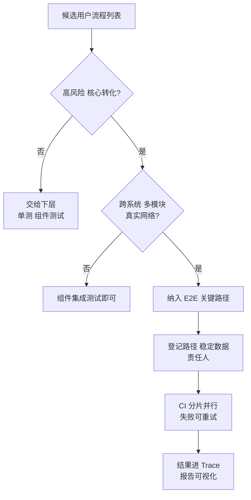
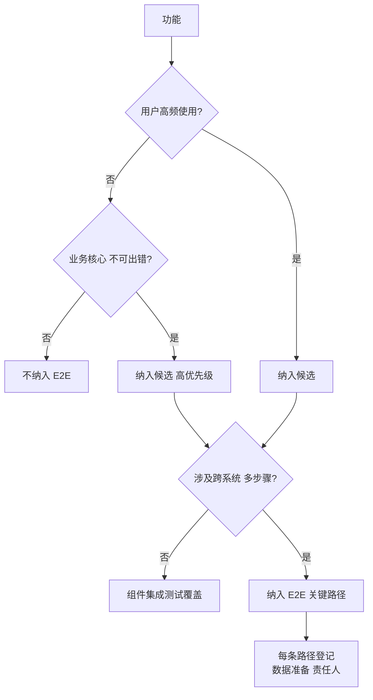

<DifficultyBadge level="advanced" />

# E2E 与 Playwright 精讲

## 一句话解释

E2E 测试在**真实浏览器里跑完整用户流程**，是测试金字塔最顶层、最接近用户的一环——它不测"函数对不对"，而是测"用户能不能完成一件事"；Playwright 用**强定位器 + 自动等待 + 网络拦截 + Trace 调试 + 分片并行**把 E2E 从"脆弱的玩具"做成"可靠的回归防线"。

## 核心流程：E2E 关键路径筛选



## 深入理解

### 1. Playwright 六件套：把 E2E 做可靠

#### 1.1 Locator 强定位器：永不脆弱的元素查找

```typescript
import { test, expect } from '@playwright/test'

test('登录流程', async ({ page }) => {
  await page.goto('/login')

  // ✅ 强定位器：按"角色 + 可访问名"定位，像用户一样找元素
  await page.getByRole('textbox', { name: '用户名' }).fill('admin')
  await page.getByLabel('密码').fill('secret')
  await page.getByRole('button', { name: '登录' }).click()

  // ✅ 文本与正则定位
  await expect(page.getByRole('heading', { name: /欢迎回来/ })).toBeVisible()

  // ✅ 组合定位：缩小范围
  const row = page.getByRole('row').filter({ hasText: '订单 #1001' })
  await row.getByRole('button', { name: '详情' }).click()

  // ✅ 链式过滤：同一容器内查找
  await page.locator('.cart').getByRole('button', { name: '结算' }).click()
})
```

**定位器优先级（与 Testing Library 同哲学）：**

| 优先级 | 方式 | 说明 |
|--------|------|------|
| 1 | `getByRole` + 可访问名 | 语义化，最接近用户感知，视觉变化不挂 |
| 2 | `getByLabel` / `getByPlaceholder` | 表单首选 |
| 3 | `getByText` / `getByTitle` | 可见文本 |
| 4 | `getByTestId` | 兜底，明确标注为测试专用 |
| ❌ | CSS 选择器 `.foo > div:nth-child(2)` | 结构变化即挂，禁止用于关键路径 |

#### 1.2 自动等待（Auto-waiting）：不用写 `sleep`

Playwright 的**动作会自动等待元素可操作**，断言会自动重试到超时——这消灭了 E2E 头号天敌"时间竞态"。

```typescript
// Playwright 每个动作内部自动等待"可见、稳定、可交互"：
await page.getByRole('button', { name: '提交' }).click()
// 自动等待：元素可见 → 稳定（不移动）→ 可接收事件 → 再点击

// 断言也是自动重试（默认 5s）：
await expect(page.getByText('下单成功')).toBeVisible()
// 轮询判断，元素一出现就通过，不用手动等

// 显式等待按"状态"而非"时间"：
await page.waitForURL('**/dashboard')        // 等 URL 变化
await page.waitForResponse(resp => resp.url().includes('/api/order') && resp.ok())
```

> **考点**：E2E 里禁止写 `await page.waitForTimeout(1000)` 这种"睡固定时间"——它把时序竞态变成概率性通过，环境一慢就 flaky。正确姿势是**等待状态而非时间**：元素可见、URL 变化、网络响应、文本出现。

#### 1.3 page.route：网络层拦截与模拟

```typescript
test('下单接口 500 时展示错误提示', async ({ page }) => {
  // 拦截所有 /api/order 请求，返回 500
  await page.route('**/api/order', route =>
    route.fulfill({ status: 500, body: 'Internal Server Error' }),
  )

  await page.goto('/checkout')
  await page.getByRole('button', { name: '提交订单' }).click()

  await expect(page.getByText('下单失败，请稍后重试')).toBeVisible()
})

test('用本地 fixture 代替第三方接口', async ({ page }) => {
  // 拦截并返回本地 JSON（fixture 目录），保持 E2E 数据可控
  await page.route('**/api/products', route =>
    route.fulfill({ path: './fixtures/products.json' }),
  )
})
```

| 能力 | 语法 | 用途 |
|------|------|------|
| 返回固定响应 | `route.fulfill({ status, body })` | 模拟错误、空数据、慢响应 |
| 放行到真实网络 | `route.continue()` | 条件拦截（只 mock 一部分） |
| 重定向请求 | `route.fulfill({ path })` | 用本地 fixture 替代外部服务 |
| 延迟响应 | `route.fulfill({ delay })` | 模拟慢网络测试 loading 态 |

> **考点**：E2E 的 mock 原则与单测一致——**只 mock 环境边界**。第三方支付、短信验证、OAuth 这类不可控服务用 `page.route` 拦截；**自有后端**是否拦截是架构决策（见下面 3 节）。

#### 1.4 Trace 查看器：失败不再靠"猜"

```typescript
// playwright.config.ts —— 失败自动保留 trace
export default defineConfig({
  use: {
    trace: 'on-first-retry',   // 第一次失败就记录 trace，重试后保留
  },
})
```

```bash
# 手动查看 trace（本地调试神器）
npx playwright show-trace test-results/xxx/trace.zip
```

**Trace 包含的现场证据：**
- 每一步动作的**操作记录**（哪个 locator、click、fill）
- 每个时刻的 **DOM 快照**（可以点开看元素）
- 每次网络请求与响应（状态码、耗时、请求体）
- **Console 日志**、网络错误、页面截图
- 时间线滑块：前后回放整个测试过程

> **考点**：Trace 是调试 flaky 的核心工具——它把"报错但不知道哪一步挂"变成"一步步回放看到底哪一刻崩"。CI 里失败的用例自动产 trace 上传 artifact，是团队排查 E2E 的标准动作。

#### 1.5 并行分片（Parallelism & Sharding）：把 30 分钟压到 3 分钟

```typescript
// playwright.config.ts
export default defineConfig({
  fullyParallel: true,            // 测试文件间并行（worker 级）
  workers: process.env.CI ? 8 : undefined,  // CI 用 8 个 worker
  retries: process.env.CI ? 2 : 0,          // CI 失败重试 2 次
})
```

```bash
# CI 分片：把测试切成 N 片并行跑（GitHub Actions 矩阵）
# 每个 job 拿一个分片，总时长 = 最慢分片
npx playwright test --shard=1/4
npx playwright test --shard=2/4
npx playwright test --shard=3/4
npx playwright test --shard=4/4
```

```yaml
# GitHub Actions：4 个 job 并行跑 4 个分片，总时长 /4
jobs:
  e2e:
    strategy:
      matrix:
        shard: [1/4, 2/4, 3/4, 4/4]
    steps:
      - run: npx playwright test --shard=${{ matrix.shard }}
      - if: always()
        uses: actions/upload-artifact@v4   # 失败 trace 上传供调试
        with:
          name: traces
          path: test-results/
```

> **考点**：分片是 E2E 上 CI 的关键——E2E 天然慢（真实浏览器），不并行就是 30 分钟+ 的 PR 等待。**分片的前提是测试相互独立**（不能共享状态），否则分片后偶发失败爆炸。独立性是并行能力的先决条件。

#### 1.6 toHaveScreenshot：视觉回归一把锁

```typescript
test('首页视觉回归', async ({ page }) => {
  await page.goto('/')
  // 首次运行生成基线快照，之后每次对比
  await expect(page).toHaveScreenshot('home.png', {
    maxDiffPixelRatio: 0.02,   // 允许 2% 像素差异（抗字体渲染抖动）
    animations: 'disabled',    // 关掉动画避免时序差异
  })
})

// 局部元素截图，比整页更抗抖动
await expect(page.getByRole('banner')).toHaveScreenshot('banner.png')
```

**视觉回归的三个现实问题：**
1. **跨环境抖动**——不同系统字体渲染、GPU 差异 → 需要 `maxDiffPixelRatio` 容差
2. **基线漂移**——每次顺手点"更新快照"会让基线悄悄退化 → 基线变更必须走 review
3. **重资产**——每张快照都是存储与维护成本 → 只对**核心页面**做，不滥用

| 方式 | 成本 | 覆盖 | 适用 |
|------|------|------|------|
| `toHaveScreenshot` | 高（存图、比对、容差调参） | 视觉布局、样式回归 | 核心页面、设计系统 |
| 传统 `toBeVisible` 断言 | 低 | 元素存在与状态 | 绝大多数 E2E |
| 组合拳 | 中 | 结构 + 关键视觉 | 推荐：默认断言，重点页面加截图 |

> **考点**：视觉回归是"样式回归"的唯一自动防线，但它**永远伴随抖动成本**。P6+ 的回答是"克制使用"：只对品牌页/设计系统做，且 CI 用容器化固定渲染环境（如固定 font、禁用动画）减小抖动源。

### 2. 与 Cypress 的架构对比

| 维度 | Playwright | Cypress |
|------|-----------|---------|
| 运行架构 | **独立进程**驱动浏览器（CDP 协议） | **注入浏览器**运行，测试代码与页面同线程 |
| 多引擎 | Chromium + Firefox + WebKit | 主打 Chromium（Firefox/WebKit 有限） |
| 多标签/多窗口 | 原生支持 | 受限（单 Tab 模型） |
| 原生事件 | 有（真实输入事件） | 部分 JS 合成事件（需插件） |
| 等待机制 | 动作自动等待 + 断言重试 | 断言链式自动重试 |
| 调试 | **Trace 回放 + 录制器** | 时间旅行 + 交互式调试面板（强） |
| 并行 | 原生 worker 并行 + 分片 | 开源版串行，并行需商业版/插件 |
| 网络 mock | `page.route`（浏览器级） | `cy.intercept` |
| 定位器 | `getByRole` 等强定位器 | `data-cy` 为主 |
| 生态 | 2026 事实主流，增长快 | 存量多，新项目渐少 |

**架构差异的本质影响：**
- Playwright 测试代码跑在 **Node 进程**，与页面隔离 → 天然支持多页面、多 Tab、跨 iframe，且崩溃不互相影响
- Cypress 测试代码跑在**浏览器内** → 调试体验好（随时看到页面状态），但受制于浏览器同源与单 Tab 限制
- Playwright 的**原生输入事件**更贴近真实用户（Cypress 的合成事件可能被真实环境差异干扰）

> **2026 视角**：Playwright 凭三引擎 + 原生并行 + Trace 调试成为新项目标配；Cypress 仍是存量重镇。迁移驱动因素通常是**并行成本**与**多浏览器覆盖**——这两点 Playwright 是开箱即用的。

### 3. E2E 用例设计：关键路径怎么选

E2E 贵、慢、脆，**只能覆盖少数关键路径**，其余交给下层测试。选路径的三条标准：



**典型 E2E 关键路径（电商示例）：**

| 路径 | 为什么是 E2E | 数据策略 |
|------|-------------|---------|
| 注册 → 登录 | 跨页面、认证状态、第三方验证码 | 测试专用账号 / API 直插 |
| 加购 → 结算 → 下单 → 支付成功 | 核心转化、真实网络、多模块 | 支付用沙箱 / route 拦截 |
| 支付失败 → 订单保留 → 重试 | 高风险分支 | 拦截 500 场景 |
| 搜索 → 筛选 → 商品详情 | 高频、跨路由、URL 状态 | fixture 数据 |
| 移动端主流程 | 视口差异 | 多项目配置（设备模拟） |

**设计三条铁律：**
1. **一条路径只验证一件事**——登录路径别顺便测支付，失败时定位不了
2. **数据可复现**——要么用 fixture 拦截、要么通过 API 预置，禁止依赖"今天数据库里恰好有这条数据"
3. **断言对齐用户结果**——断言"下单成功页出现"而非"请求发出"

### 4. 如何让 E2E 稳定不 flaky

Flaky 的根因几乎都是**时序竞态 + 数据不稳定 + 环境抖动**，逐一治理：

| Flaky 来源 | 表现 | 治理手段 |
|-----------|------|---------|
| 时序竞态 | 元素还没渲染就点 | 依赖自动等待，禁止 `waitForTimeout`，等状态而非等时间 |
| 数据不稳定 | 依赖数据库现存数据 | fixture 拦截 / API 预置 / 测试账号隔离 |
| 外部服务 | 第三方 API 抖动 | `page.route` 拦截，或标记为"外部冒烟"单独跑 |
| 动画/加载 | 布局在移动中 | `animations: 'disabled'`，等 `toBeVisible` + 稳定态 |
| 并发共享状态 | 并行 worker 改同一数据 | 每条用例独立数据、独立账号、随机后缀 |
| 环境差异 | 字体/GPU 渲染不同 | 容器化 + `maxDiffPixelRatio` 容差（视觉回归） |
| 全局副作用 | localStorage/缓存残留 | `page.context().clearCookies()` 等前置清理 |

```typescript
// 稳定 E2E 的完整姿势
test('下单成功', async ({ page }) => {
  // 前置：干净状态
  await page.goto('/')
  await page.evaluate(() => localStorage.clear())

  // 网络：关键接口拦截为可控 fixture
  await page.route('**/api/order', r =>
    r.fulfill({ path: './fixtures/order-success.json' }),
  )

  // 动作：全用强定位器 + 自动等待
  await page.getByRole('button', { name: '立即购买' }).click()
  await page.getByRole('button', { name: '提交订单' }).click()

  // 断言：等用户可见结果，而不是猜时长
  await expect(page.getByText('订单提交成功')).toBeVisible()
})
```

**CI 层的稳定性兜底：**
- `retries: 2` —— 偶发抖动自动重跑，但**重试是兜底不是解药**（flaky 必须根因治理）
- Trace 全量保留 —— 每次失败都能回放定位
- 分片 + 独立数据 —— 并行不互相污染
- **flaky 率看板** —— 超过阈值（如 1%）就必须停工治理，否则团队会"习惯性忽略红测"，防线失效

> **考点**：面试官真正想看的是你**理解 flaky 的根源并系统治理**，而不是"我加了 retries"。一句到位：**"retries 只兜概率，真正的稳定性来自数据可控、等待状态化、环境隔离；并且我会监控 flaky 率，红了就修，不让红灯被习惯性无视。"**

## 面试问法

- 🔥 **Playwright 比 Cypress 强在哪？架构上为什么更优？**
  - 独立进程驱动浏览器（CDP），与页面隔离 → 多 Tab、多 iframe、原生事件、崩溃隔离
  - 三引擎支持 + 原生 worker 并行分片 + Trace 回放调试
  - Cypress 注入浏览器、单 Tab、并行需商业版；2026 Playwright 是事实主流

- 🔥 **为什么 E2E 容易 flaky？怎么治理？**
  - 根因：时序竞态、数据不稳定、外部服务、环境抖动、并发污染
  - 治理：等状态而非等时间（禁止 waitForTimeout）、fixture 拦截、测试数据隔离、动画关闭、容器化渲染
  - retries 只兜底，核心是让测试"数据可控 + 等待状态化 + 环境隔离"

- 🔥 **Playwright 的自动等待是怎么实现的？为什么不用 sleep？**
  - 动作自动等待"可见、稳定、可交互"；断言自动重试到超时
  - 等状态而非等时间：URL、响应、元素可见都是"状态信号"
  - sleep 把竞态变成概率性通过，环境慢就随机挂

- 🔥 **E2E 用例怎么设计？关键路径怎么选？**
  - 高频 + 核心转化 + 跨系统多模块才值得 E2E；其余交给单测/组件测试
  - 一条路径只验证一件事，断言对齐用户可见结果
  - 数据可复现：fixture 拦截或 API 预置，不依赖数据库现存数据

- ⭐ **page.route 能做什么？什么时候用？**
  - 拦截请求返回固定响应（mock 错误、慢网络）、本地 fixture 替代外部服务、条件放行
  - 用于第三方不可控服务（支付、验证码）与错误分支测试
  - 自有后端是否拦截是架构决策：真后端保真度高但依赖环境，接口层面可用契约测试兜底

- ⭐ **视觉回归怎么做？有什么坑？**
  - `toHaveScreenshot` 首次生成基线，之后像素对比；配 `maxDiffPixelRatio` 容差、`animations: 'disabled'`
  - 坑：跨环境渲染抖动、基线漂移（顺手更新快照）、存储与维护成本
  - 克制使用：只对核心页面/设计系统，基线变更走 review

- ⭐ **E2E 怎么上 CI？并行分片怎么做？**
  - `fullyParallel` + workers 并行，GitHub Actions 矩阵分片 `--shard=1/N`
  - 分片前提是测试相互独立（不共享状态），否则并行后偶发爆炸
  - 失败 Trace 上传 artifact，供排查；retries 兜底偶发抖动

## 💡 AI 辅助学习

> 用这个 Prompt 练 E2E 设计思维：
> "你是一个资深 QA 工程师。我要为一个电商站设计 E2E 测试体系，功能包括：登录（含第三方验证码）、搜索筛选、加购结算、下单支付（支付宝/微信）、订单售后。
> 请：1）用决策标准筛选出哪些必须进 E2E 关键路径、哪些交给组件测试，并说明理由；2）为最关键的一条路径写完整 Playwright 测试（强定位器 + 自动等待 + 网络拦截 + 断言用户可见结果）；3）列出这条路径最容易 flaky 的 5 个点，逐个给出治理手段；4）设计这个 E2E 在 GitHub Actions 上的分片并行方案，含 Trace 上传与重试策略。"

## 关联知识

- [前端测试体系](/engineering/frontend-testing) — E2E 在测试金字塔中的位置
- [测试架构设计](./test-architecture) — E2E 在 CI 流水线中的分层
- [Mock 策略精讲](./mock-strategy) — page.route 与 MSW 的边界
- [CI/CD 与工程化](/engineering/ci-cd) — CI 中的测试阶段与质量门禁
