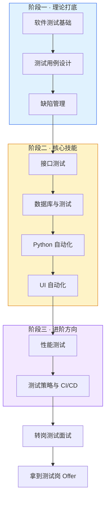

# 🧪 测试（转岗 QA）

**写给前端开发者**：你已经具备 JS/TS 编程思维、调试能力、对页面渲染与网络请求的底层理解——这是转测试岗最值钱的隐性资产。本模块不讲前端单测那一套，专注**测试岗位独有的知识**：黑盒测试为主、测试用例设计、缺陷管理、接口测试、SQL、Python 自动化、UI 自动化、性能测试，从理论到拿到 Offer 的完整路线，共 10 个知识点，按 🟢🟡🔴 三级递进。

<DifficultyBadge level="beginner" /> 测试理论 · <DifficultyBadge level="intermediate" /> 用例设计与缺陷管理 · <DifficultyBadge level="intermediate" /> 接口 / 数据库 / 自动化 · <DifficultyBadge level="advanced" /> 性能测试与转岗面试

::: tip 🧭 前端转测试的差异化优势
前端转测试不是"降维"，而是**差异化竞争**：大部分纯手工测试人员看不懂代码、不会查接口、不会写 SQL，而你天然会——**能看代码的测试 → 灰盒/接口/自动化测试**，正是薪资更高的方向。面试时把这四条讲清楚：① 有编程能力，自动化上手快；② 懂页面渲染和网络请求，能定位是前端还是后端问题；③ 调试思维强，复现 bug 更高效；④ 理解开发语言，和开发沟通顺畅。
:::

---

## 🟢 入门 · 测试理论（3 个）

测试岗位的"基本功三件套"，也是转岗面试**必考**的部分。

  <a href="./test-basics" class="card">
    <h3>软件测试基础 <Badge type="info" text="🔥高频" /></h3>
    
测试目的与 7 大原则、测试类型、黑盒/白盒/灰盒、V 模型 vs 敏捷测试

  </a>
  <a href="./test-case-design" class="card">
    <h3>测试用例设计 <Badge type="info" text="🔥高频" /></h3>
    
等价类、边界值、判定表、场景法、错误推测法、正交试验法，每个都有真实例子

  </a>
  <a href="./defect-management" class="card">
    <h3>缺陷管理 <Badge type="info" text="🔥高频" /></h3>
    
Bug 生命周期、严重程度 vs 优先级、缺陷报告 10 要素、禅道/JIRA 实战

  </a>

---

## 🟡 进阶 · 核心技能（4 个）

前端转测试的"加分四件套"，把你和纯手工测试拉开差距。

  <a href="./interface-testing" class="card">
    <h3>接口测试 <Badge type="info" text="🔥高频" /></h3>
    
HTTP 协议、Postman 实战、接口测试用例、契约校验

  </a>
  <a href="./database-testing" class="card">
    <h3>数据库与测试 <Badge type="info" text="⭐中频" /></h3>
    
SQL 基础、数据校验、造数/清数、数据一致性测试

  </a>
  <a href="./automation-basics" class="card">
    <h3>Python 自动化基础 <Badge type="info" text="🔥高频" /></h3>
    
Python 语法速成、pytest 框架、自动化脚本思路

  </a>
  <a href="./ui-automation" class="card">
    <h3>UI 自动化测试 <Badge type="info" text="⭐中频" /></h3>
    
Selenium/Playwright、元素定位、Page Object 模式、稳定性处理

  </a>

---

## 🔴 高级 · 进阶面试（3 个）

转岗面试的"深度与差异化"，展示你不仅有手，还有脑子。

  <a href="./performance-testing" class="card">
    <h3>性能测试入门 <Badge type="info" text="⭐中频" /></h3>
    
性能指标（TPS/响应时间/QPS）、JMeter 压测、性能调优思路

  </a>
  <a href="./test-ci-strategy" class="card">
    <h3>测试策略与 CI/CD <Badge type="info" text="⭐中频" /></h3>
    
测试金字塔、测试左移、自动化在流水线中的落地

  </a>
  <a href="./test-interview" class="card">
    <h3>转岗测试面试专题 <Badge type="info" text="🔥高频" /></h3>
    
转岗动机话术、高频面试题、简历包装、薪资谈判

  </a>

---

## 🎁 三件套速成资源

> 下面三件套是配合本模块的**考前冲刺资源**，点击后在新窗口打开、可离线使用：

- 📄 <a href="../qa-cheatsheet.pdf" target="_blank" rel="noopener">测试岗位 A4 速查 PDF</a> — 测试理论/用例设计/缺陷管理一页速记，面试前 30 秒扫一遍
- 🎬 <a href="../qa-demo.html" target="_blank" rel="noopener">测试交互式演示</a> — 跟着演示走一遍 Bug 生命周期与用例设计流程
- 📝 <a href="../qa-quiz.html" target="_blank" rel="noopener">测试 Mini Quiz</a> — 转岗 QA 自测题，检验你的测试思维
