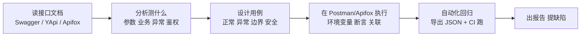
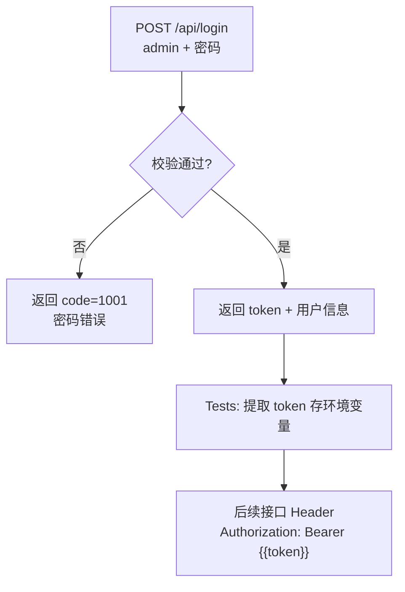
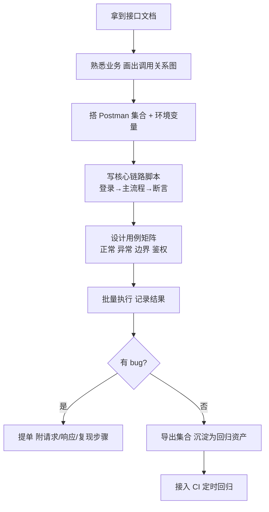

<DifficultyBadge level="intermediate" />

# 接口测试

## 一句话解释

接口测试是**绕过界面、直接对服务端接口（API）发请求并验证响应**的测试方式——它是 QA 的核心技能，因为前后端联调、业务逻辑校验、异常兜底都沉淀在接口层。你作为前端转岗，天然优势是**已经懂 HTTP、会看 JSON**，本页就是把前端经验"翻译"成测试岗的用法。

## 核心流程：一个接口从文档到测试报告



## 深入理解

### 1. 接口测试到底测什么

| 维度 | 测什么 | 典型 bug 例子 |
|------|--------|--------------|
| 参数校验 | 必填/类型/长度/格式/枚举 | 传 `age=abc` 返回 500 而非参数错误提示 |
| 业务逻辑 | 核心流程是否按需求执行 | 下单接口库存扣了但订单没生成 |
| 异常处理 | 服务异常/超时/依赖挂了是否有兜底 | 依赖服务挂了返回裸异常栈给前端 |
| 鉴权 | token/权限/越权 | 无 token 也能拿到用户信息 |
| 幂等性 | 同一请求多次执行结果一致 | 支付接口点两次扣了两次款 |

> **前端视角**：你以前调接口只关心"能不能拿到数据"，测试岗关心的是"**拿不到、拿错、拿慢了**"三种情况下的表现。接口文档里的"返回码表"就是你的测试依据。

### 2. HTTP 基础（测试岗必须背）

#### 2.1 请求方法

| 方法 | 语义 | 幂等？ | 测试场景 |
|------|------|--------|---------|
| GET | 查询/获取 | ✅ 幂等 | 查列表、查详情 |
| POST | 新建/触发动作 | ❌ 非幂等 | 登录、下单、创建 |
| PUT | 整体更新（替换） | ✅ 幂等 | 更新用户完整信息 |
| PATCH | 部分更新 | ✅ 幂等 | 只改手机号 |
| DELETE | 删除 | ✅ 幂等 | 删数据 |
| HEAD | 只拿响应头 | ✅ | 探测资源是否存在 |
| OPTIONS | 询问支持的方法 | ✅ | CORS 预检 |

> **考点**：GET 和 POST 的区别（长度限制/缓存/是否放 body/幂等）、PUT vs PATCH（全量 vs 局部）。接口测试设计里常问"这个接口该用什么方法"。

#### 2.2 状态码（必须脱口而出）

| 状态码 | 含义 | 常见触发 |
|--------|------|---------|
| 200 | 成功 | 正常响应 |
| 201 | 创建成功 | POST 新建资源 |
| 204 | 成功但无内容 | DELETE |
| 301 / 302 | 永久/临时重定向 | 旧地址跳转 |
| 400 | 请求参数错误 | 必填缺失、格式错 |
| 401 | 未认证 | 没带 token 或 token 失效 |
| 403 | 已认证但无权限 | 普通用户访问管理员接口 |
| 404 | 资源不存在 | 路径写错、id 不存在 |
| 405 | 方法不允许 | GET 接口用 POST 调 |
| 409 | 冲突 | 重复创建、并发写 |
| 429 | 请求过多 | 触发限流 |
| 500 | 服务器内部错误 | 代码抛异常没兜住 |
| 502 / 503 | 网关错误/服务不可用 | 上游挂了、超载 |

> **考点**：401 vs 403 的区别是最高频的送分题——**401 是"你是谁"没通过，403 是"你是谁我知道了但没资格"**。

#### 2.3 请求头 Header

| Header | 作用 | 测试要点 |
|--------|------|---------|
| `Content-Type` | 请求体的媒体类型 | 写错了服务端解析不了 body |
| `Accept` | 期望返回格式 | 设 `application/xml` 看是否按 xml 返回 |
| `Authorization` | 认证信息（Bearer token） | 缺/错/过期 token 的 401 表现 |
| `Cookie` | 会话凭证 | 登录后带 cookie 访问受限接口 |
| `User-Agent` | 客户端标识 | 防爬校验会校验它 |
| `X-Request-Id` | 链路追踪 | 排查问题时全链路可关联 |

#### 2.4 Content-Type 与请求体格式

| Content-Type | 对应请求体 | 后端常见写法 |
|-------------|-----------|-------------|
| `application/json` | `{"username":"admin"}` | `@RequestBody` / `req.body`（JSON 解析） |
| `application/x-www-form-urlencoded` | `username=admin&pwd=123` | 表单方式 |
| `multipart/form-data` | 文件 + 文本字段 | 上传接口 |
| `application/octet-stream` | 二进制流 | 下载、原始文件 |

> **高频坑**：用 `application/json` 却传了 JSON 字符串而不是对象、表单接口却用 JSON body——都是测试要抓的 400 报错。

### 3. RESTful API 规范（测试岗要能挑刺）

REST 是一套"用 HTTP 动词 + URL 表达资源"的约定，接口测试里按它设计能发现"不合规"接口。

```bash
# 规范示例
GET    /api/users            # 查用户列表
GET    /api/users/{id}       # 查单个用户
POST   /api/users            # 新建用户
PUT    /api/users/{id}       # 更新整个用户
PATCH  /api/users/{id}       # 局部更新
DELETE /api/users/{id}       # 删除用户

# 反例（测试应指出的不规范）
GET    /api/getUserList      # URL 用动词
POST   /api/users/delete     # 删除用 POST 且 URL 带动词
GET    /api/queryUser?type=delete  # 用参数表达动作
```

**REST 合规测试要点：**
- **资源用名词复数**，动作交给 HTTP 方法
- **状态码语义化**：创建返回 201，删除返回 204，错误别全返回 200 再塞个 code
- **版本化**：`/api/v1/users`，升级不破坏旧客户端
- **分页/过滤统一风格**：`?page=1&pageSize=20&sort=-createdAt`
- **响应结构统一**：`{ code, message, data }`，便于前端统一处理

### 4. Postman / Apifox 使用

工具本身是测试的执行载体，核心能力五个：**集合、环境变量、断言、参数化、关联**。

#### 4.1 集合（Collection）与组织

```
登录项目/
├── 用户模块
│   ├── 用户登录
│   ├── 获取用户信息
│   └── 更新用户
├── 订单模块
│   ├── 创建订单
│   └── 查询订单列表
└── 回归测试套件
```

集合可以整体导出为 JSON，或配合 Newman 在 CI 里跑——这是"手工点接口"升级为"接口自动化"的第一步。

#### 4.2 环境变量（Environment）

把域名、token 这类"会变的值"抽成变量，用 `{{变量名}}` 引用，切换环境（dev/test/prod）不用改任何请求。

```bash
# 环境变量示例
base_url = https://test-api.example.com
token    = (由登录接口动态写入)
page_size = 20
```

URL 里写 `{{base_url}}/api/users?pageSize={{page_size}}`，Header 里写 `Authorization: Bearer {{token}}`。

#### 4.3 断言（Tests 脚本）

Postman 的断言跑在 `Tests` 标签页，用 JavaScript（和 Apifox 兼容 `pm` 语法）：

```javascript
// 1. 状态码断言
pm.test('返回 200', function () {
  pm.response.to.have.status(200)
})

// 2. 业务码断言
pm.test('业务 code 为 0', function () {
  const data = pm.response.json()
  pm.expect(data.code).to.eql(0)
  pm.expect(data.message).to.eql('success')
})

// 3. 字段值与类型断言
pm.test('返回用户信息完整', function () {
  const data = pm.response.json().data
  pm.expect(data.username).to.be.a('string')
  pm.expect(data.id).to.be.above(0)
  pm.expect(data.tags).to.be.an('array')
})

// 4. 响应时间断言
pm.test('响应时间小于 500ms', function () {
  pm.expect(pm.response.responseTime).to.be.below(500)
})

// 5. 多接口组合断言（校验列表里包含目标项）
pm.test('列表中包含 id=100 的用户', function () {
  const list = pm.response.json().data.list
  const ids = list.map(item => item.id)
  pm.expect(ids).to.include(100)
})
```

#### 4.4 关联（接口间传值）

最典型：登录拿到 token → 存起来 → 后续接口 Header 带上。

```javascript
// 登录接口 Tests 脚本：提取 token 写入环境变量
pm.test('保存 token 供后续接口使用', function () {
  const data = pm.response.json()
  pm.environment.set('token', data.data.token)
})

// 另一个接口的 Tests 脚本：关联创建后拿到的 id
pm.test('保存新建用户的 id', function () {
  const data = pm.response.json()
  pm.environment.set('newUserId', data.data.id)
})
```

然后其他接口的 URL/Header/body 里写 `{{token}}`、`{{newUserId}}` 即可。

#### 4.5 参数化（数据驱动）

手工一条条改用例太慢，用数据文件一次跑多组数据。Postman 支持 CSV / JSON 数据文件，跑集合时选 Run → Data。

```csv
username,password,expect_code
admin,123456,0
admin,wrong_pwd,1001
,
,123456,1002
```

```javascript
// 请求体里用数据文件字段（双花括号）
// body: {"username": "{{username}}", "password": "{{password}}"}

// 断言里用 data 引用
pm.test('校验返回码', function () {
  pm.expect(pm.response.json().code).to.eql(expect_code)
})
```

> **Apifox 差异点**：Apifox 更贴合国内团队（接口文档 + 用例 + Mock + 自动化一体），断言脚本同样用 `pm.test`，且支持"用例步骤引用接口"自动生成接口测试。两者会一个，另一个上手很快。

### 5. 接口测试用例设计

#### 5.1 用例维度总览

| 维度 | 覆盖内容 | 举例（以"创建订单"为例） |
|------|---------|------------------------|
| 正常 | 合法参数下的主流程 | 正确参数下单成功，返回订单号 |
| 异常 | 非法参数、错误处理 | 商品不存在、库存不足、金额为负 |
| 边界 | 临界值、极限值 | 金额 0、超大数量、超长字符串、空字符串 |
| 鉴权 | 未登录/权限不足/token 过期 | 无 token → 401；普通用户下单 admin 专属 → 403 |
| 安全 | 注入、越权、敏感信息泄露 | 用户名传 SQL 注入串、遍历 id 越权查看他人订单 |

#### 5.2 边界值设计（等价类 + 边界值）

```
金额 price（单位：分，必填，1 ≤ price ≤ 100000000）
├── 有效等价类：1 ～ 100000000
│   ├── 上边界内一点：1、100000000
│   └── 中间值：500000
└── 无效等价类：<1、>100000000、空、非数字、负数
    └── 边界外一点：0、100000001、-1、"abc"、null
```

> **考点**：边界值测试是接口用例设计的"标准动作"——**每个数值字段都要测下边界值本身和紧邻它的值**（如 0/1、99999999/100000000/100000001）。

#### 5.3 常见异常用例清单

- 必填参数缺失（逐个缺）
- 多余参数（传了文档里没有的字段）
- 参数类型错误（number 传 string）
- 参数格式错误（email/phone/日期格式）
- 参数组合互斥（如"微信支付"和"货到付款"同时传）
- 分页参数越界（page=0、page=-1、pageSize=10000）
- 无权限访问（未登录、低权限访问高权限接口）
- 并发请求（重复提交、同时删除）

### 6. 常见接口测试场景实战

#### 6.1 登录获取 token（最核心场景）



**测试要点：**
- 正确账号密码 → 拿到 token，校验 token 格式（JWT 用在线工具解码验证 payload）
- 错误密码 / 不存在的用户 → 明确错误码
- 同一账号重复登录 → 旧 token 是否失效（踢人下线）
- 并发登录多个设备 → 是互踢还是允许多端
- token 过期时间 → 构造过期 token 验证 401 行为

#### 6.2 分页列表接口

```bash
GET /api/users?page=1&pageSize=20
```

| 用例 | 期望 |
|------|------|
| 第一页 + 默认 pageSize | 返回条数 ≤ pageSize，total 为总数 |
| 最后一页 | 返回条数 < pageSize（可能为 0） |
| 越界页（page=9999） | 返回空列表而非报错 |
| pageSize 超上限（传 100000） | 被限制到最大值或明确报错 |
| 排序字段校验 | 按 `sort=-createdAt` 时时间倒序 |
| 筛选条件 | `status=1` 时只含该状态数据 |

**典型断言：**

```javascript
pm.test('分页返回结构正确', function () {
  const data = pm.response.json().data
  pm.expect(data.list).to.be.an('array')
  pm.expect(data.list.length).to.be.at.most(20)   // 不超过 pageSize
  pm.expect(data.total).to.be.a('number')
  pm.expect(data.page).to.eql(1)
})
```

#### 6.3 文件上传 / 下载

**上传：** 用 `multipart/form-data`，字段包含文件 + 可选附加参数（如类型、说明）。

```bash
POST /api/upload
Content-Type: multipart/form-data

file=@demo.png  type=avatar
```

测试要点：小文件/大文件/0 字节文件、非图片格式伪装成图片、超大小限制文件、并发上传、上传后返回的 URL 能否访问。

**下载：** GET 文件 URL，断言响应头 `Content-Type` 与文件长度。

```javascript
pm.test('下载文件成功且类型正确', function () {
  pm.response.to.have.status(200)
  const ct = pm.response.headers.get('Content-Type')
  pm.expect(ct).to.include('image/png')
  pm.expect(pm.response.responseSize).to.be.above(0)
})
```

### 7. 接口测试的完整工作流



## 面试问法

- 🔥 **接口测试都测什么？**
  - 参数校验、业务逻辑、异常处理、鉴权、幂等性
  - 展开：正常流程验证功能、异常用例验证兜底、边界值验证极限、无权限验证安全

- 🔥 **GET 和 POST 的区别？**
  - 语义上 GET 查询、POST 提交；GET 参数在 URL、POST 可在 body
  - GET 有长度限制、可缓存、刷新无副作用；POST 不缓存、可传大数据
  - GET 幂等、POST 非幂等（涉及重复提交问题）

- 🔥 **401 和 403 的区别？**
  - 401 未认证（没有/无效 token），403 已认证但无权限
  - 用户看到的典型场景：未登录跳登录页 = 401；登录了但点管理员功能 = 403

- 🔥 **怎么用 Postman 做接口关联？**
  - 登录接口 Tests 里用 `pm.response.json()` 取 token，`pm.environment.set('token', ...)` 存环境变量
  - 后续接口 Header 引用 `{{token}}`
  - 同理可存新建资源的 id 供后续接口使用

- ⭐ **什么是幂等性？为什么支付接口必须幂等？**
  - 同一请求执行一次和执行多次结果一致
  - 支付/下单接口用户可能连点、重试，若非幂等会重复扣款/重复下单
  - 通常靠唯一请求号（幂等键）+ 服务端去重实现

- ⭐ **接口测试和单元测试的区别？**
  - 单测是开发测自己代码的最小单元（函数），接口测试是测系统对外暴露的 API 契约
  - 接口测试更贴近真实用户行为，能发现联调问题、鉴权问题、参数传递问题

- ⭐ **你作为前端转测试，做接口测试有什么优势？**
  - 懂 HTTP 协议、会读 JSON、看得懂前后端联调
  - 能站在"客户端调用方"角度设计用例，快速定位问题是前端传参问题还是后端逻辑问题
  - 熟悉抓包（DevTools）、会看请求/响应细节，能独立构造真实请求复现 bug

## 💡 AI 辅助学习

> 用这个 Prompt 实战练习接口测试：
> "我是一个懂前端开发、想转做测试工程师的人。请帮我设计一个**图书管理系统的接口测试用例集**，包含以下接口：
> 1. POST /api/login（登录获取 token）
> 2. GET /api/books（分页查图书列表，支持 keyword、category 筛选）
> 3. POST /api/books（新增图书）
> 4. PUT /api/books/{id}（更新图书）
> 5. DELETE /api/books/{id}（删除图书）
>
> 请输出：
> 1. 每个接口的正常/异常/边界/鉴权用例，用表格整理
> 2. 登录接口的 Postman Tests 脚本（提取 token 存环境变量）
> 3. 列表接口的分页边界值用例
> 4. 三个最容易出 bug 的测试点及原因
> 5. 一份 JSON 数据文件（CSV 格式），用于登录接口的参数化测试"

### 🤖 AI 输出成果（参考模板）

> 让 AI 生成"接口测试用例模板"：**接口名 / 前置条件 / 请求方法 / URL / 请求参数 / 预期状态码 / 预期业务码 / 预期响应体 / 实际结果 / 是否通过**，然后把你的接口文档丢给它，让它按模板批量生成用例，你负责评审用例合理性。

## 关联知识

- [数据库与测试](./database-testing) — 接口返回的数据要在库里验证真伪
- [Python 自动化基础](./automation-basics) — 用 requests + pytest 把 Postman 用例自动化
- [Mock 与测试替身](./mock-strategy) — 后端没就绪时用 Mock 挡一挡
- [覆盖率与 TDD 与 BDD](./coverage-tdd) — 接口测试也要讲覆盖率与测试组织
