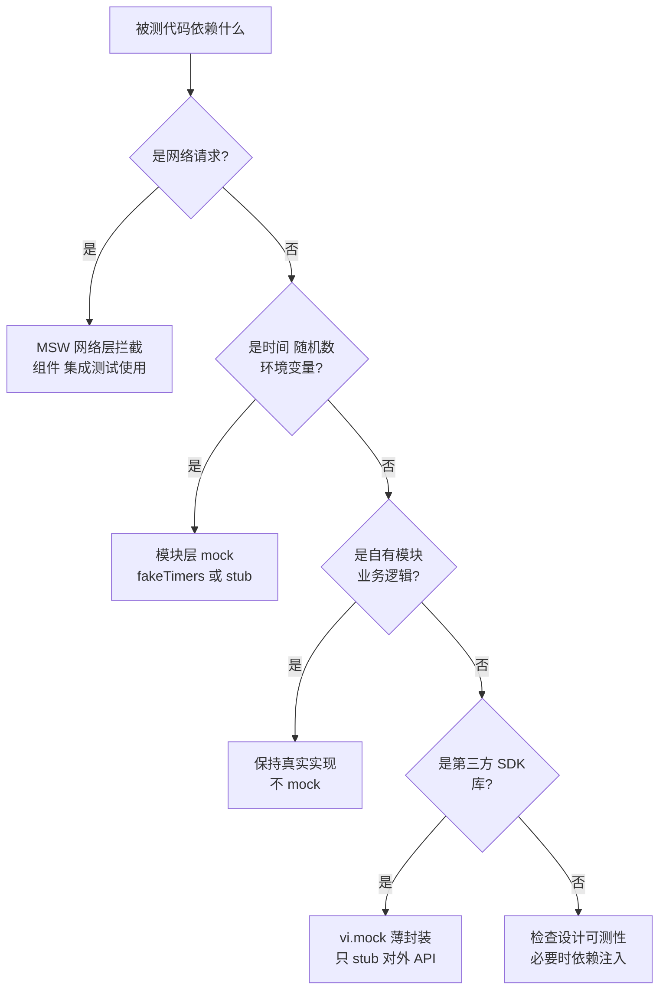

<DifficultyBadge level="intermediate" />

# Mock 策略精讲

## 一句话解释

Mock 的本质是**在测试中替换不稳定或不相关的外部依赖**（网络、时间、随机数、硬件），让测试快、稳、可复现；但 mock 是把双刃剑——**mock 少、mock 边界**，只替掉"不属于被测逻辑"的部分，业务逻辑必须保持真实，否则测试测的就是假的。

## 核心流程：Mock 决策树



> **记忆锚点**：mock 决策优先级 —— 网络用 MSW、时间随机数用 stub、自有业务逻辑不 mock、第三方库薄封装。越靠近"环境"，越该 mock；越靠近"业务"，越该真实。

## 深入理解

### 1. 模块层 vs 网络层：两种 mock 的本质差异

| 维度 | 模块层 `vi.mock` / `jest.mock` | 网络层 MSW |
|------|------------------------------|-----------|
| 拦截位置 | 模块导入（ESM/CJS 解析时） | HTTP 请求（Node 端 / 浏览器 Service Worker） |
| mock 对象 | 函数、导出、模块 | 真实请求的响应 |
| 是否执行网络栈 | 否，直接跳过 | 是，走完整请求（fetch/XHR 真实发出） |
| 被测代码感知 | 无感知，但依赖"模块边界"清晰 | 完全无感知，fetch 代码原样运行 |
| 典型场景 | 单测隔离、控制分支、替换 SDK | 组件/集成测试，验证数据流 |
| 维护成本 | 模块结构变化就挂 | 契约变化（接口字段）才挂 |

```javascript
// 模块层：直接替换模块导出（快、但"跳过"了真实调用链）
vi.mock('../api/user', () => ({
  fetchUser: vi.fn().mockResolvedValue({ id: 1, name: 'Alice' }),
}))

// 网络层：拦截真实请求，组件代码一字不改
import { http, HttpResponse } from 'msw'
import { setupServer } from 'msw/node'

const server = setupServer(
  http.get('/api/users/:id', ({ params }) =>
    HttpResponse.json({ id: params.id, name: 'Alice' }),
  ),
)

beforeAll(() => server.listen())
afterEach(() => server.resetHandlers())  // 每个用例间恢复，避免 handler 污染
afterAll(() => server.close())
```

**怎么选：**

- 测**纯模块逻辑**（一个工具函数内部怎么调 API 后的分支处理）→ 模块层 mock 足够，快
- 测**组件与真实网络栈的协作**（loading / 错误态 / 重试 / 取消）→ 必须网络层 MSW，因为模块 mock 无法触发 `fetch` 的 abort 与超时路径
- 测**契约回归**（后端改了接口字段，前端测试要能发现）→ MSW 基于接口定义写 handler，天然对齐契约

> **考点**：模块层 mock 最大的坑是"测了假的接口形状"——只要模块 mock 的返回值与真实接口漂移，测试全绿但生产爆炸。所以需要**契约测试**（如 MSW + OpenAPI 生成 handler）或至少让 MSW handler 与接口类型同源。

### 2. Mock 边界原则：该 mock 什么，不该 mock 什么

核心判断标准：**mock 边界 = 依赖的"不确定性"边界**。只 mock 三样东西——网络、时间、随机（含第三方 SDK 这类不可控黑盒），其余一律真实。

| 依赖类型 | 是否 mock | 理由 |
|---------|----------|------|
| 自己的业务函数 / 工具函数 | ❌ 不 mock | mock 后测试无法发现业务逻辑回归 |
| 自己的组件 / 状态管理 | ❌ 不 mock | 这正是被测对象 |
| HTTP 请求 | ✅ mock（MSW） | 外部服务不稳定、跨环境不可复现 |
| 时间（Date / setTimeout） | ✅ mock（fakeTimers） | 让测试确定性 |
| 随机数 / uuid | ✅ mock 或注入 | 否则结果不可断言 |
| 第三方 SDK（埋点、推送、登录 SDK） | ✅ 薄封装 mock | 黑盒且无业务价值 |
| 浏览器 API（canvas、媒体、IndexedDB） | ✅ mock 或 polyfill | 测试环境无此能力 |

```javascript
// ❌ 反模式：mock 掉业务计算，测了个寂寞
vi.mock('../utils/discount', () => ({
  calcDiscount: vi.fn().mockReturnValue(80),  // 把核心逻辑假掉了
}))
test('显示折后价', () => {
  expect(calcFinalPrice(100)).toBe(80)  // 无论 discount 逻辑怎么改都绿
})

// ✅ 只 mock 边界：时间、请求真实计算逻辑
vi.useFakeTimers()
vi.mock('../api', () => ({ getCoupon: vi.fn() }))
// calcDiscount 用真实实现
```

> **考点**：mock 边界的衡量标准是"**这条 mock 去掉后测试是否还能稳定通过**"。如果去掉某个 mock 测试必挂或极不稳定，说明它是"环境边界"，该 mock；如果去掉后测试依然稳定，说明它 mock 错了，应该删掉。

### 3. Faker 数据工厂：让 mock 数据可控又逼真

固定写死的数据会让测试陷入"顺风车假阳性"——数据恰好符合某分支。用 **faker 工厂 + overrides** 生成高多样性数据，同时保留对关键字段的精确控制。

```typescript
// factories/user.ts
import { faker } from '@faker-js/faker'

export interface User {
  id: string
  name: string
  email: string
  role: 'admin' | 'user' | 'editor'
  plan: 'free' | 'pro' | 'enterprise'
  createdAt: Date
}

// 工厂函数：随机生成 + 支持按需覆盖
export function buildUser(overrides: Partial<User> = {}): User {
  return {
    id: faker.string.uuid(),
    name: faker.person.fullName(),
    email: faker.internet.email(),
    role: faker.helpers.arrayElement(['admin', 'user', 'editor']),
    plan: faker.helpers.weightedArrayElement([
      { weight: 6, value: 'free' },
      { weight: 3, value: 'pro' },
      { weight: 1, value: 'enterprise' },
    ]),
    createdAt: faker.date.past({ years: 2 }),
    ...overrides,
  }
}

export function buildUserList(count: number, overrides: Partial<User> = {}): User[] {
  return Array.from({ length: count }, () => buildUser(overrides))
}
```

**工厂 vs 裸对象的取舍：**

| 方式 | 优点 | 缺点 |
|------|------|------|
| 写死对象字面量 | 简单直接 | 字段漏改、数据同质化、类型漂移无人知 |
| faker 随机生成 | 数据多样、贴近真实分布 | 随机可能踩到意外分支（要控 seed） |
| **工厂 + overrides** | 兼具可控与多样 | 需维护工厂，类型变更要同步 |

```javascript
// 配合 fake seed 实现"随机但可复现"
beforeEach(() => faker.seed(42))  // 同一个 seed 产出同一组数据，调试可复现
```

> **考点**：mock 数据的两难——太随机测不稳，太固定测不出问题。解法是 **overrides 管关键字段、faker 管无关字段**：关键字段由测试语义决定，无关字段随机化暴露"对字段的意外耦合"。

### 4. Mock 时间与随机数：让"快进"可控

```javascript
// fakeTimers：把时间变成可编程的
import { vi, afterEach } from 'vitest'

beforeEach(() => vi.useFakeTimers())
afterEach(() => vi.useRealTimers())

test('debounce 在 delay 内只触发一次', () => {
  const fn = vi.fn()
  const debounced = debounce(fn, 300)

  debounced('a')
  debounced('b')
  debounced('c')

  vi.advanceTimersByTime(299)
  expect(fn).not.toHaveBeenCalled()   // 300ms 前不触发
  vi.advanceTimersByTime(1)
  expect(fn).toHaveBeenCalledTimes(1) // 恰好 300ms 触发一次
})
```

```javascript
// 随机数 / uuid 的三种可控方式
// 1. 注入（最推荐）：把随机源作为参数传进来
export function genCode(rand: () => number = Math.random) {
  return Math.floor(rand() * 10000)
}
test('用固定 rand 断言', () => {
  expect(genCode(() => 0.5)).toBe(5000)
})

// 2. mock 模块
vi.mock('nanoid', () => ({ nanoid: () => 'fixed-id' }))

// 3. fakeTimers 同时覆盖 Date.now 与 setInterval
test('会话 30 分钟过期', () => {
  vi.setSystemTime(new Date('2026-01-01T00:00:00Z'))
  startSession()
  vi.setSystemTime(new Date('2026-01-01T00:30:01Z'))
  expect(isExpired()).toBe(true)
})
```

> **考点**：fakeTimers 的经典坑——**混用真实异步**。如果被测代码里既有 `setTimeout` 又有真实 `Promise`，`vi.advanceTimersByTime` 可能推进不了 Promise 微任务，导致测试挂掉。应对：用 `await vi.advanceTimersByTimeAsync(n)` 异步推进，或把真实异步的依赖 mock 成同步。

### 5. 常见 Mock 反模式

| 反模式 | 表现 | 危害 | 纠正 |
|--------|------|------|------|
| **Mock 一切** | 全部依赖都用 `vi.mock` | 测试与真实行为脱节，回归漏网 | 只 mock 环境边界 |
| **mock 业务逻辑** | 把核心计算函数也 mock 掉 | 红灯永亮绿灯永不，测试无意义 | 业务逻辑用真实实现 |
| **断言 mock 调用而非行为** | `expect(fetch).toHaveBeenCalled()` | 验证了"调了接口"，没验证用户看到什么 | 断言渲染结果 / 状态变化 |
| **测实现细节** | 断言组件内部 `setState` 调用 | 重构即挂，脆弱测试 | 测行为（屏幕输出） |
| **共享可变 mock 状态** | 多个用例共用同一 mock 实例不清空 | 用例间互相污染，偶发失败 | `beforeEach` 重置，`mockReset` |
| **mock 掉假"不稳定"** | 用 mock 掩盖真实抖动（如 CSS 加载顺序） | 测试绿但生产闪屏 | 修正测试环境，而非掩耳盗铃 |
| **过度特化返回值** | 所有测试返回同一个"完美数据" | 永远走 happy path，分支未覆盖 | 每个用例用不同 overrides 构造不同数据 |

```javascript
// ❌ 断言实现调用：重构必挂
test('点击后请求用户', () => {
  render(<Profile userId="1" />)
  fireEvent.click(screen.getByRole('button'))
  expect(fetchUser).toHaveBeenCalledWith('1')  // 关心"怎么调"而非"用户看到什么"
})

// ✅ 断言用户可见行为：重构稳
test('点击后展示用户信息', async () => {
  render(<Profile userId="1" />)
  fireEvent.click(screen.getByRole('button'))
  expect(await screen.findByText('Alice')).toBeInTheDocument()
})
```

## 面试问法

- 🔥 **vi.mock 和 MSW 的区别？各自什么时候用？**
  - vi.mock 在模块层替换导出，跳过网络栈，快但"测的是 mock 后的形状"；MSW 在网络层拦截真实请求，组件代码不感知，更接近真实数据流
  - 纯模块单测用 vi.mock；组件/集成测试验证 loading、错误、重试、abort 等真实网络路径用 MSW
  - 原则：网络用 MSW、时间随机数用 stub、业务逻辑不 mock

- 🔥 **什么是"mock 边界"？怎么判断该不该 mock 一个东西？**
  - 只 mock 环境边界（网络、时间、随机数、第三方黑盒 SDK），业务逻辑保持真实
  - 判断法：去掉这个 mock 测试是否还能稳定通过——能，说明 mock 错了；不能且必挂，说明是真正的环境边界
  - 目标是让测试"测真实逻辑 + 替不稳定环境"，而不是"测一堆假数据"

- 🔥 **mock 数据一般怎么生成？faker 工厂怎么用？**
  - 用 faker 生成高多样性数据，工厂函数支持 overrides 覆盖关键字段
  - 关键字段由测试语义决定，无关字段随机化暴露意外耦合；用 `faker.seed()` 保证可复现
  - 优势：防"顺风车假阳性"，数据贴近真实分布，类型安全

- ⭐ **mock 时间怎么测 debounce / 定时器？有什么坑？**
  - `vi.useFakeTimers()` + `vi.advanceTimersByTime(n)` 快进；异步定时器用 `advanceTimersByTimeAsync`
  - 坑：真实 Promise 与 fake timer 混用会推不动微任务；每个用例后 `useRealTimers()` 还原
  - Date.now 相关逻辑用 `vi.setSystemTime()` 固定时间点

- ⭐ **mock 有哪些常见反模式？你们怎么避免？**
  - mock 一切、mock 业务逻辑、断言 mock 调用而非行为、共享可变 mock 状态
  - 规避：代码评审把 mock 列为重点、mock 决策树进团队规范、写测试后自查"删掉 mock 会怎样"

- ⭐ **mock 会掩盖什么真实问题？怎么平衡？**
  - 掩盖接口契约漂移、第三方行为变化、真实性能问题
  - 对策：契约测试（MSW handler 与接口定义同源）、少量真实网络冒烟、mock 收敛到环境边界

## 💡 AI 辅助学习

> 用这个 Prompt 练 Mock 策略思维：
> "你是一个资深前端测试专家。我有一个购物车结算模块：它依赖一个第三方支付 SDK（不可控）、一个结算接口（POST /api/checkout）、内部有优惠券计算逻辑（含折扣、满减、叠加规则）、还有 5 分钟超时倒计时。
> 请设计一套 Mock 策略：1）逐项判断每个依赖该不该 mock、用模块层还是网络层、为什么；2）给出优惠券计算的测试用例清单（正常/边界/异常）；3）示范 fakeTimers 如何测倒计时超时；4）指出这套设计里最容易踩的 mock 反模式。用表格 + 代码组织回答。"

## 关联知识

- [前端测试体系](/engineering/frontend-testing) — Mock 策略总览与选型
- [测试架构设计](./test-architecture) — Mock 如何嵌入整体测试体系
- [覆盖率与 TDD](./coverage-tdd) — mock 与覆盖率的联动
- [AI 辅助测试全流程](./ai-assisted-testing) — AI 生成 mock 工厂与人机分工
