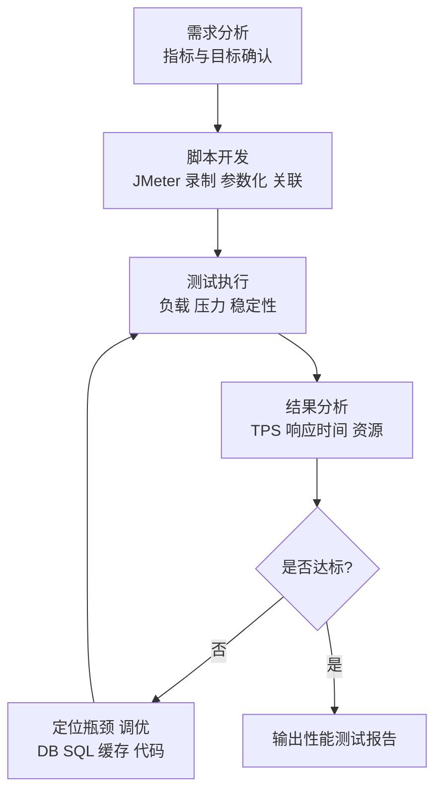
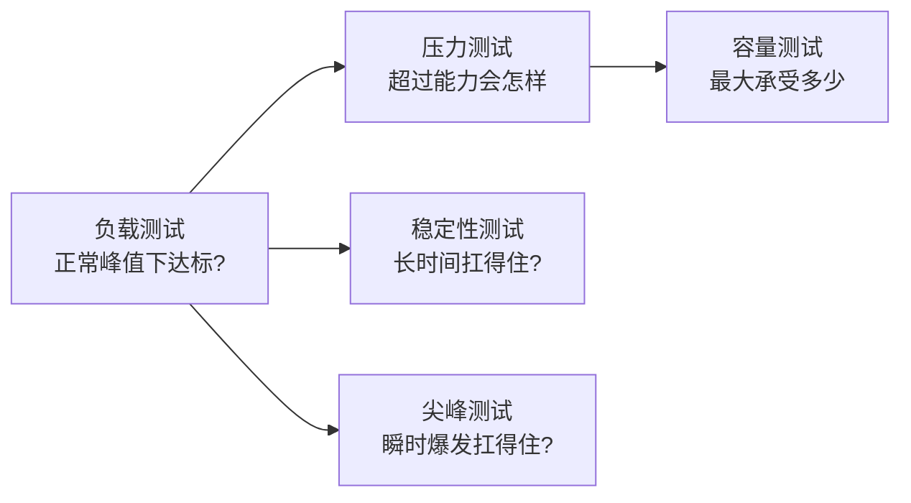
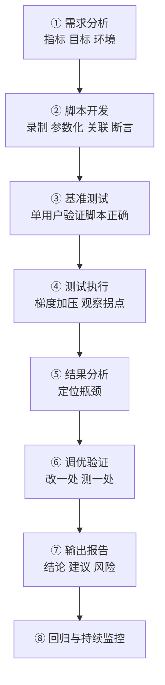
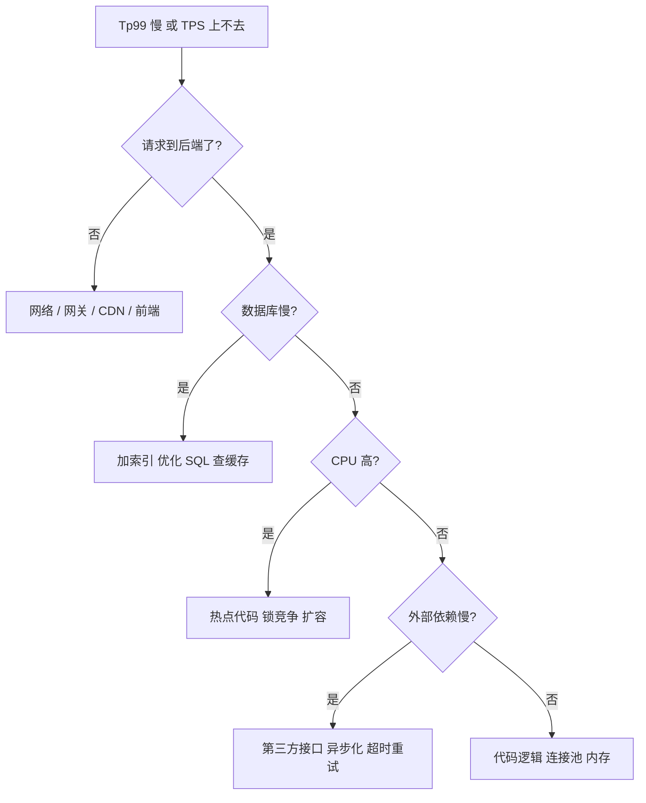

<DifficultyBadge level="advanced" />

# 性能测试入门

## 一句话解释

性能测试通过**模拟大量并发用户访问**，回答三个问题：系统**快不快**（响应时间）、**稳不稳**（长时间/高负载下不崩）、**能扛多少**（吞吐量与瓶颈点）——它是把"代码能跑"升级为"**上线后扛得住真实流量**"的关键环节，也是 QA 岗的核心进阶技能。

## 核心流程：性能测试五步闭环



## 深入理解

### 1. 核心指标：先搞清楚"测什么"

| 指标 | 含义 | 一句话判断 |
|------|------|-----------|
| **响应时间** | 从发请求到收到完整响应的时间 | 越快越好；关注 **Tp95 / Tp99**（95%/99% 请求都小于该值），比平均值更能暴露长尾慢请求 |
| **TPS** | Transactions Per Second，每秒处理的事务数 | 衡量"业务处理能力"，如每秒完成多少笔下单 |
| **QPS** | Queries Per Second，每秒查询数 | 偏向查询类请求（读接口、搜索） |
| **并发数** | 同时在线/同时发请求的用户数 | 不是"在线人数"，是"同一时刻真正在打请求的数" |
| **吞吐量** | 单位时间处理请求的总量 | 和 TPS 相关，衡量系统整体容量 |
| **错误率** | 失败请求占比 | 一般要求 < 1%，高负载下允许略高但有红线 |
| **资源利用率** | CPU / 内存 / 磁盘 / 网络的使用率 | CPU 飙满 / 内存泄漏 / IO 等待是常见瓶颈信号 |

> **考点**：**TPS 和 QPS 的区别**——QPS 侧重"每秒查询次数"（读），TPS 侧重"每秒事务数"（一个事务可能包含多次查询），业务系统常混用，但严格说 TPS ⊇ QPS。另一个易错点：**平均值会骗人**（99 个 100ms + 1 个 10s 平均才 200ms），所以一定要看 **Tp95 / Tp99 / 最大响应时间**。

```python
# 响应时间分位数估算示例（假设一批耗时数据）
# 耗时列表 [100,120,130,150,200,9000,300,250,180,160] 单位 ms
# Tp90 ≈ 排序后第 9 个 ≈ 300ms（90% 的请求都在 300ms 内完成）
# Tp99 要求更长样本；平均值 ≈ 1088ms 被 9000ms 的慢请求带偏
```

### 2. 性能测试的五种类型

| 类型 | 目标 | 典型做法 |
|------|------|---------|
| **负载测试** | 在**预期峰值负载**下，系统是否满足性能要求 | 模拟正常 / 峰值并发，验证响应时间达标 |
| **压力测试** | 持续**加压超过设计能力**，找到崩溃点 / 瓶颈点 | 逐步加大并发，观察系统何时开始恶化、报错 |
| **稳定性测试**（耐久测试） | **长时间运行**（几小时~几天）验证不崩、不内存泄漏 | 中等负载持续跑，监控内存 / CPU 是否随时间爬升 |
| **尖峰测试** | 应对**瞬时突发流量**（秒杀、热点事件） | 瞬间并发拉高，看系统是否扛得住、恢复多快 |
| **容量测试** | 确定系统**最大能承受**多少并发/数据量 | 梯度加压，找到拐点（性能骤降的并发数） |

**五者关系速记：**



> **考点**：负载 vs 压力最常见的口误——**负载测试在"设计容量内"验证达标；压力测试是"故意超载"找系统何时崩、怎么崩**。稳定性测试关注的是"随时间"的变化（内存泄漏、连接泄漏），不是"随并发"的变化。

### 3. JMeter 基础：六大组成件

JMeter 是 Apache 开源的 Java 性能测试工具，**纯 GUI 操作 + jmx 脚本文件**，跨平台、生态成熟。

| 组件 | 作用 | 常用配置 |
|------|------|---------|
| **线程组**（Thread Group） | 定义并发用户模型 | 线程数（用户数）、Ramp-Up 时间、循环次数 |
| **取样器**（Sampler） | 发什么请求 | HTTP Request：协议、域名、路径、方法、参数 |
| **监听器**（Listener） | 看结果 | 查看结果树（看每个响应）、聚合报告（TPS/响应时间汇总） |
| **断言**（Assertions） | 判断请求对错 | 响应断言：状态码=200、内容包含"success" |
| **参数化** | 让每个用户数据不同 | CSV Data Set Config、用户自定义变量、函数助手 `${__Random}` |
| **关联**（Correlation） | 从上一个响应提取值供下一个请求用 | 正则表达式提取器、JSON 提取器，存到 `${token}` |

**关键概念示例：**

```text
线程组配置（模拟 100 个并发用户逐步启动）：
  - 线程数：100
  - Ramp-Up：10 秒（10 秒内 100 个用户陆续启动，避免瞬间全砸）
  - 循环次数：30（每人连续请求 30 次）

参数化：用 CSV 文件给 100 个用户不同的账号密码
  - CSV Data Set Config → 指定 users.csv → 变量名 username,password

关联：登录接口返回 token，供后续下单接口使用
  - 登录响应 JSON 里取 data.token
  - JSON Extractor → 变量名 token
  - 下单请求头里引用：Authorization: Bearer ${token}
```

**命令行走压测（生产实践，不用 GUI）：**

```bash
# -n 非 GUI 模式  -t 指定脚本  -l 输出结果文件  -e 生成报告  -o 报告目录
jmeter -n -t login.jmx -l result.jtl -e -o report_dir

# 指定并发数与循环（覆盖脚本内配置，方便调参）
jmeter -n -t login.jmx -Jthreads=100 -Jrampup=10 -Jloops=30 -l result.jtl -e -o report_dir
```

> **考点**：**GUI 只用于调试脚本，压测执行必须用命令行（非 GUI）**——GUI 本身占用内存、影响结果准确性，且生产服务器通常没有图形界面。`-e -o` 一键生成 HTML 报告（含图表、TPS、响应时间分布）是 JMeter 5+ 的标准姿势。

### 4. 性能测试完整流程



**每个环节的关键动作：**

| 环节 | 关键动作 | 常见坑 |
|------|---------|--------|
| 需求分析 | 确认目标指标（并发数、TPS、Tp95）、业务模型、压测环境 | 没目标就压测 = 压了也说不清结果好坏 |
| 脚本开发 | 录制 + 参数化（不能所有用户同一账号）+ 关联（token/csrf） | 脚本跑通但业务数据全一样 → 结果失真 |
| 基准测试 | 先用 1 个用户跑通脚本，确认响应正常 | 跳过这步 → 后面 500 错误全是脚本问题 |
| 测试执行 | 梯度加压（如 10→50→100→200），找到性能拐点 | 一上来就 1000 并发，脚本/环境问题淹没真实瓶颈 |
| 结果分析 | 结合 TPS、响应时间、错误率、服务端资源一起看 | 只看客户端指标，忽略 DB/CPU 证据 |
| 报告输出 | 给出结论（达标/不达标）、瓶颈定位、优化建议、遗留风险 | 只有图表没有结论 = 无效报告 |

### 5. 常见性能问题与调优方向

**前端转测试的优势：你懂"整条链路"——用户操作 → 请求 → 后端 → 数据库。**

| 瓶颈类型 | 典型现象 | 调优方向 |
|---------|---------|---------|
| **数据库缺索引** | 数据量大后查询变慢，TPS 上不去 | `EXPLAIN` 看执行计划，给 WHERE / JOIN / ORDER BY 字段加索引 |
| **慢查询** | 单接口耗时长，Tp99 飙升 | 定位慢 SQL，优化写法、减少全表扫描、避免 `SELECT *` |
| **缓存未命中/缺失** | 相同热点数据反复查库 | 引入 Redis，热点数据缓存 + 设置合理过期时间 |
| **N+1 查询** | 列表接口一次循环查 N 次库 | 改为 JOIN / 批量查询 / 子查询合并 |
| **连接池打满** | 错误率上升，报"连接池满" | 调大连接池大小、缩短连接持有时间、复用连接 |
| **接口瓶颈** | 单个接口逻辑重、循环调外部服务 | 异步化、批量处理、增加并发上限、限流 |
| **CPU 瓶颈** | CPU 飙满，吞吐上不去 | 找热点代码（锁竞争、死循环、密集计算）、扩容 |
| **内存泄漏** | 长时间运行内存爬升 | 稳定性测试抓泄漏，检查静态集合/未释放连接 |

```sql
-- 慢查询排查示例：先看执行计划，判断是否全表扫描
EXPLAIN SELECT * FROM orders WHERE user_id = 123 AND status = 'paid';
-- 若 type=ALL（全表扫描）→ 加复合索引 (user_id, status)
CREATE INDEX idx_user_status ON orders (user_id, status);
```



> **考点**：性能分析要讲**"证据链"**——不猜，用数据定位：先看客户端 TPS/响应时间拐点 → 再看服务端 CPU/内存 → 再看数据库慢日志/执行计划，**逐层下钻**。前端背景可以加一句：**"前端接口慢不一定是后端慢，可能是接口返回大对象、图片未压缩、或并发下浏览器连接限制，我会从前到后逐层排查。"**

## 面试问法

- 🔥 **性能测试有哪些核心指标？Tp95/Tp99 为什么比平均值重要？**
  - 响应时间、TPS、QPS、并发数、吞吐量、错误率、资源利用率
  - 平均值被长尾慢请求带偏；Tp95/Tp99 反映绝大多数用户的真实体验

- 🔥 **TPS 和 QPS 的区别？**
  - QPS 侧重每秒查询次数（读接口）；TPS 侧重每秒事务数（一个事务含多次请求）
  - 业务系统常混用，严格说 TPS 更偏"完整业务单位"

- 🔥 **负载测试、压力测试、稳定性测试的区别？**
  - 负载：设计容量内验证达标；压力：超载找崩溃点；稳定性：长时间跑验证不泄漏不崩
  - 口诀：负载看"够不够"，压力看"会不会崩"，稳定性看"撑不撑得住"

- 🔥 **JMeter 怎么做参数化和关联？为什么要做？**
  - 参数化：CSV Data Set / 用户变量 / 随机函数，让不同用户用不同数据（避免账号冲突、贴近真实）
  - 关联：正则/JSON 提取器取上一个响应的 token，供下一个请求用（登录→下单必须带 token）
  - 不做关联的后果：请求 401、业务数据全是同一个

- 🔥 **压测时为什么必须用命令行（非 GUI）？**
  - GUI 消耗内存、影响结果准确性、生产无图形界面
  - `jmeter -n -t script.jmx -l result.jtl -e -o report_dir` 一键出报告

- 🔥 **定位性能瓶颈的思路？**
  - 逐层下钻：客户端指标 → 服务端资源 → 数据库慢查询/索引 → 代码热点
  - 用证据定位不猜测；常见：缺索引、慢查询、缓存缺失、N+1、连接池、外部依赖

- ⭐ **性能测试报告要包含什么？**
  - 测试环境与配置、压测模型（并发/时长）、核心指标数据（TPS/响应时间/错误率）、瓶颈分析、优化建议、结论（是否达标）与遗留风险

- ⭐ **发现性能问题后你怎么办？**
  - 复现并保留证据 → 与开发/架构沟通定位 → 逐个优化验证（改一处测一处）→ 回归压测 → 沉淀到报告与后续监控

## 💡 AI 辅助学习

> 用这个 Prompt 练性能测试设计思维：
> "你是一名资深性能测试工程师。我要为一个电商秒杀场景做性能测试，技术栈：前端 Vue + 后端 Spring Boot + MySQL + Redis。
> 请：1）设计完整的性能测试方案（压测指标、目标值、压测模型、五类测试各自的场景与参数）；
> 2）用 JMeter 步骤写出脚本设计（线程组、HTTP 请求、参数化用户、token 关联、断言、监听器），并给出命令行执行与报告生成命令；
> 3）假设压测结果 Tp99 超标且 TPS 上不去，画出排查路径，逐个列出可能的瓶颈与对应调优手段；
> 4）给出一份性能测试报告模板（含结论、证据、建议的完整骨架）。"
>
> 再给一个指标辨析 Prompt：
> "请解释 TPS、QPS、并发用户数、吞吐量、响应时间的区别与换算关系，用秒杀系统的具体数值举例说明，并说明为什么 Tp99 比平均值更能反映用户真实体验。"

## 关联知识

- [测试用例设计](./test-case-design) — 性能场景也是用例设计的一部分
- [接口测试](./interface-testing) — 接口是性能压测的基本单位
- [数据库与测试](./database-testing) — 数据库索引、慢查询与测试数据
- [UI 自动化测试](./ui-automation) — UI 自动化 vs 性能测试的边界
- [测试策略与 CI/CD](./test-ci-strategy) — 性能测试在发布流程中的位置（压测门禁）
- [转岗测试面试专题](./test-interview) — 性能测试相关面试题
