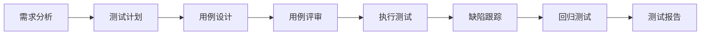
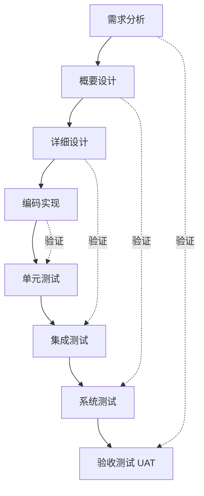

<DifficultyBadge level="beginner" />

# 软件测试基础

## 一句话解释

软件测试是通过**人工或自动化手段运行软件**，验证它是否符合需求、并尽可能发现缺陷的过程。它的核心目的不是"证明软件没有 bug"，而是**尽可能早、尽可能多地把缺陷找出来**——"测试通过"永远不等于"没有 bug"，只能说"在当前这批用例下没发现缺陷"。

## 核心流程：一次测试活动怎么走

> **记忆锚点**：需求 → 计划 → 设计 → 评审 → 执行 → 跟踪 → 回归 → 报告。转岗面试问你"测试流程是什么"，按这条线答就够了。

## 深入理解

### 1. 测试的目的是什么

| 目的 | 一句话说明 |
|------|-----------|
| 发现缺陷 | 找出软件中不符合需求、超出预期的行为（**最核心**） |
| 验证需求 | 确认软件做了"该做的事"（正向验证） |
| 预防缺陷 | 通过早参与需求/设计评审，把缺陷扼杀在产生之前 |
| 降低风险 | 让发布决策有数据支撑，而不是"感觉没问题" |
| 建立信心 | 给产品/开发/用户提供"可以发布"的质量信号 |

**反直觉的第一课**：测试员的目标是**把软件测挂**，而不是测好。测出 bug 不是失败，是价值；一个"一次通过"的测试用例，价值远低于一个"一测就炸"的用例。

### 2. 软件测试 7 大原则

这是转岗面试**背诵题**，也是实际工作的底层逻辑：

| # | 原则 | 一句话理解 | 现实含义 |
|---|------|-----------|---------|
| 1 | 测试显示缺陷的存在 | 测试能证明"有 bug"，不能证明"没 bug" | "全部通过"≠"没缺陷"，只能说当前用例下没发现 |
| 2 | 穷尽测试不可能 | 输入与组合是无限的，测不完 | 必须用等价类/边界值等方法做**取舍** |
| 3 | 尽早测试 | 越早发现，修复成本越低 | 需求评审就该参与；缺陷越晚发现越贵 |
| 4 | 缺陷集群性 | 缺陷集中在小部分模块 | 约 80% 缺陷集中在 20% 模块（Pareto），重点模块重点测 |
| 5 | 杀虫剂悖论 | 反复用同一套用例，发现不了新 bug | 用例要持续更新，配合回归 + 探索式测试 |
| 6 | 测试依赖上下文 | 不同场景测试方式不同 | 银行重安全、电商重性能、游戏重体验 |
| 7 | 没有缺陷的谬论 | 没找到 bug ≠ 软件满足用户 | 系统是否可用取决于需求与用户，不只是缺陷数量 |

> **面试速记**：展示存在、穷尽不可能、尽早、缺陷集群、杀虫剂悖论、依赖上下文、没有缺陷的谬论。前三个是"测试的边界"，后四个是"测试的策略"。

### 3. 测试类型

| 类型 | 英文 | 测什么 | 谁执行 | 关键点 |
|------|------|--------|--------|--------|
| **冒烟测试** | Smoke | 核心主流程能否跑通 | 测试/开发 | "没冒烟就别进门"，几分钟内快速失败 |
| **功能测试** | Functional | 每个功能是否符合需求 | 测试 | 黑盒为主，逐条对照需求 |
| **回归测试** | Regression | 改代码后老功能是否被破坏 | 测试 | 改代码必回归，依赖用例库 |
| **集成测试** | Integration | 模块间交互、接口对接 | 测试+开发 | 关注数据传递与接口契约 |
| **系统测试** | System | 完整系统的功能+非功能 | 测试 | 端到端，含性能/安全/兼容 |
| **验收测试 UAT** | UAT | 用户角度是否可接受 | 用户/产品 | 签收依据，最接近真实使用 |

**容易混的三组：**
- **冒烟 vs 回归**：冒烟是"最核心的几十条用例，验证还能不能跑"，版本发布前必做；回归是"所有老功能的用例库"全量重跑。冒烟是回归的"先行版"。
- **功能 vs 系统**：功能测试一个个功能单独验；系统测试把整个系统当整体验（含非功能）。系统测试是在功能测试基础上做"体检"。
- **集成 vs 系统**：集成测试验"模块之间怎么对接"；系统测试验"整套系统对外表现"。

### 4. 黑盒 vs 白盒 vs 灰盒

| 维度 | 黑盒测试 | 白盒测试 | 灰盒测试 |
|------|---------|---------|---------|
| 看代码 | 不看，只看输入/输出 | 看，测代码路径 | 部分看（接口、SQL、数据结构） |
| 关注点 | 功能是否符合需求 | 语句/分支/路径覆盖 | 接口契约、数据流转 |
| 常见方法 | 等价类、边界值、场景法 | 语句覆盖、分支覆盖、路径覆盖 | 接口测试、SQL 数据校验 |
| 谁来测 | **通用 QA（你的主战场）** | 开发或资深测试 | 测试 + 开发协作 |
| 转岗定位 | 转岗第一年靠它 | 加分项（看代码） | **进阶方向**（接口/SQL 就在这层） |

> **转岗提醒**：前端转测试，起步是黑盒（主流测试岗的日常工作），但你能写 JS、看得懂代码，天然是"灰盒选手"——这就是你和纯手工测试的差异点，面试时要主动讲出来。

### 5. 测试生命周期：V 模型 vs 敏捷测试

**V 模型**（传统瀑布式，左侧开发、右侧测试，两端一一对应）：

**敏捷测试**（当前主流）不是放弃 V 模型的对应关系，而是**把测试"左移"**：边开发边测试，每个迭代（Sprint）内持续验证。核心特征：

| 维度 | V 模型（传统） | 敏捷测试 |
|------|--------------|---------|
| 介入时机 | 开发基本完成后才全面测试 | 每个迭代边开发边测 |
| 节奏 | 大阶段串行，缺陷集中爆发 | 1-2 周一个迭代，缺陷当场发现 |
| 文档 | 重文档，用例先评审再执行 | 轻文档，用例随需求即席维护 |
| 自动化 | 后期才上 | **自动化优先**，测试金字塔模型 |
| 质量责任 | 测试兜底 | **全团队对质量负责**（Everyone owns quality） |
| 反馈速度 | 慢 | 快，持续集成持续验证 |

> **面试一句话**："V 模型是瀑布时代的测试生命周期，强调开发与测试的对应关系；敏捷测试把 V 模型左移，用短迭代 + 持续测试 + 自动化优先，把缺陷挡在上线前。"

### 6. QA vs 测试工程师

| 维度 | QA（质量保证） | 测试工程师（QC） |
|------|---------------|-----------------|
| 英文 | Quality Assurance | Quality Control |
| 关注 | **流程 / 预防 / 体系** | **执行 / 发现** |
| 典型动作 | 定义测试规范、评审需求、度量质量 | 设计用例、执行测试、提交缺陷 |
| 核心提问 | "如何让过程不产出缺陷" | "当前产品有没有缺陷" |
| 类比 | 做饭的流程管理 | 尝菜的人 |
| 转岗定位 | 测试做熟之后往上走的角色 | **转岗第一年的定位** |

> **记忆锚点**：QC 是"事后抓"（Control），QA 是"事前防"（Assurance）。测试工程师先把 QC 干好，再往 QA 方向提升。

## 面试问法

- 🔥 **测试的目的是什么？**
  - 不是证明"没 bug"，而是**尽可能发现缺陷** + 验证需求 + 降低风险
  - 关键话术：测试显示缺陷的存在，但不能证明缺陷不存在

- 🔥 **软件测试 7 大原则有哪些？**
  - 测试显示缺陷的存在 / 穷尽测试不可能 / 尽早测试 / 缺陷集群性 / 杀虫剂悖论 / 测试依赖上下文 / 没有缺陷的谬论

- 🔥 **黑盒、白盒、灰盒测试的区别？**
  - 按"是否看代码"分：黑盒不看、白盒看、灰盒部分看（接口/SQL）
  - 顺势说：我是前端转岗，能看懂代码，定位问题更快，可以做灰盒/接口测试

- ⭐ **冒烟测试和回归测试的区别？**
  - 冒烟：核心主流程快速跑通，版本发布前"验尸"，几分钟；回归：全量老用例，改代码后防破坏

- ⭐ **V 模型和敏捷测试的区别？**
  - V 模型：开发后测试，阶段对应；敏捷：测试左移，短迭代 + 持续测试 + 自动化优先

- ⭐ **QA 和测试工程师的区别？**
  - 测试工程师做执行与发现（QC），QA 管流程与预防（Assurance）；先做好测试再往 QA 走

## 💡 AI 辅助学习

> 用这个 Prompt 练测试思维：
> "你是一位资深测试面试官。请给我 10 道关于'软件测试目的与 7 大原则'的场景选择题——每题给一个真实工作场景 + 4 个选项，让我选出对应的原则或正确结论。一次只出 1 题，等我回答后再出下一题并点评。全部完成后，再给我 5 个'拿到一个新功能你第一步做什么'的实战小场景，让我口述测试思路，你逐条按'目的→类型→方法→风险'四个维度打分。"

### 🤖 AI 输出成果（基于上面这个 Prompt 生成）

> 下面三件套就是 AI 基于上面这个 Prompt 实际生成的测试学习资源，点击后在新窗口打开、可离线使用：

- 📄 <a href="../qa-cheatsheet.pdf" target="_blank" rel="noopener">测试岗位 A4 速查 PDF</a> — 测试理论/用例设计/缺陷管理一页速记
- 🎬 <a href="../qa-demo.html" target="_blank" rel="noopener">测试交互式演示</a> — 跟着演示走一遍测试流程与 Bug 生命周期
- 📝 <a href="../qa-quiz.html" target="_blank" rel="noopener">测试 Mini Quiz</a> — 自测你的测试思维

## 关联知识

- [测试用例设计](./test-case-design) — 7 大原则里"穷尽测试不可能"的具体解法
- [缺陷管理](./defect-management) — 测试执行的产出物：缺陷报告
- [接口测试](./interface-testing) — 进阶方向：灰盒测试的起点
- [转岗测试面试专题](./test-interview) — 转岗动机话术与高频面试题
