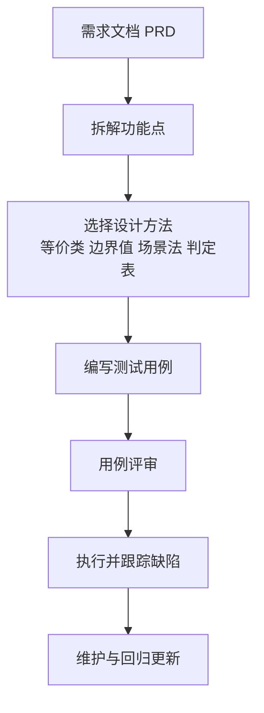
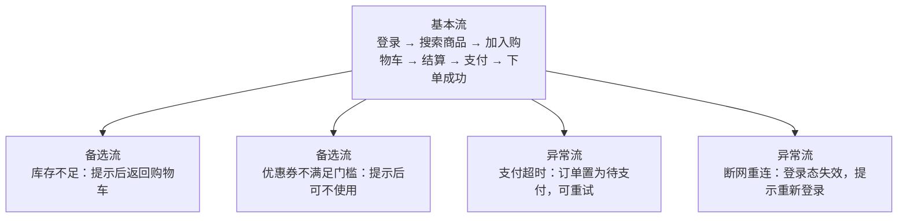

<DifficultyBadge level="beginner" />

# 测试用例设计

## 一句话解释

测试用例设计就是用**最少数量、最高效率的用例，覆盖最多可能出错的分支**。核心思想是：输入组合是无限的、测不完，所以必须用科学方法把"无限输入"压缩成"有限高价值用例"——**用例设计能力，是区分测试员和"点工"的分水岭**。

## 核心流程：一个用例怎么诞生

## 深入理解

### 1. 测试用例的 8 要素

| 要素 | 说明 | 示例（登录功能） |
|------|------|-----------------|
| 用例编号 | 唯一标识，`TC_模块_序号` | `TC_Login_002` |
| 用例标题 | 一句话说清"测什么" | 验证空密码点击登录给出提示 |
| 前置条件 | 测试前必须满足的状态 | 打开登录页 |
| 测试步骤 | 一步步的操作指令 | 输入用户名 → 密码留空 → 点登录 |
| 测试数据 | 输入的数据 | 用户名 `abc123`，密码为空 |
| 预期结果 | 期望软件的表现 | 提示"请输入密码"，不跳转 |
| 实际结果 | 执行后真实表现 | （执行时填写） |
| 优先级 | P0-P3，决定执行顺序 | P1 |

**一条完整用例长这样：**

| 字段 | 内容 |
|------|------|
| 用例编号 | `TC_Login_002` |
| 所属模块 | 登录 |
| 用例标题 | 验证空密码点击登录给出提示 |
| 优先级 | P1 |
| 前置条件 | 打开登录页 |
| 测试数据 | 用户名 `abc123`，密码留空 |
| 测试步骤 | 1. 输入用户名 `abc123`；2. 密码留空；3. 点击"登录"按钮 |
| 预期结果 | 页面提示"请输入密码"，不跳转、不请求接口 |
| 实际结果 | 待填写 |
| 执行状态 | 待执行 |

### 2. 等价类划分法

**原理**：把无穷无尽的输入，按"是否产生同类结果"分成若干等价类，每类只测一个代表值。**有效等价类**（合理输入）和**无效等价类**（不合理输入）都要测——无效类最能抓 bug。

**真实例子：登录用户名输入框**

> 需求：用户名必填，要求 **6-20 位字母或数字**。

| 类别 | 等价类 | 测试数据 | 预期结果 |
|------|--------|---------|---------|
| 有效 | 6-20 位纯字母 | `abcdef` | 通过 |
| 有效 | 6-20 位纯数字 | `123456` | 通过 |
| 有效 | 字母数字混合 | `abc123` | 通过 |
| 无效 | 空 | （不输入） | 提示"用户名不能为空" |
| 无效 | 少于 6 位 | `abc12` | 提示"至少 6 位" |
| 无效 | 多于 20 位 | 21 个字符 | 提示"最多 20 位" |
| 无效 | 含特殊字符 | `abc#123` | 提示"仅支持字母数字" |
| 无效 | 含中文 | `测试abc` | 提示"仅支持字母数字" |

> **实战贴士**：每个无效等价类都要单独一条用例。如果把"空、小于6位、含特殊字符"合在一起测，报错了你不知道是哪个条件触发的。

### 3. 边界值分析法

**原理**：大量缺陷都发生在**边界附近**（`==` 写成了 `<`、长度判断少一位）。边界值法是对等价类的补充：测上边界、下边界、以及紧挨边界的值（`边界±1`）。**等价类管"桶"，边界值管"桶边"**，两者几乎总是一起用。

**真实例子：注册表单年龄校验**

> 需求：年龄必须在 **18-60 周岁**之间（含 18 和 60）。

| 测试点 | 测试数据 | 预期结果 |
|--------|---------|---------|
| 下边界 | 18 | 通过 |
| 下边界 - 1 | 17 | 拒绝，提示"未满 18 岁" |
| 上边界 | 60 | 通过 |
| 上边界 + 1 | 61 | 拒绝，提示"超过 60 岁" |
| 边界内代表值 | 35 | 通过 |
| 非数字 | `abc` | 拒绝，提示"请输入数字" |

> **记忆锚点**：边界值法只测 4 个点（上界、上界+1、下界、下界-1）加 1 个代表值，就能覆盖这 6 条用例。这就是"最少用例覆盖最多分支"的体现。

### 4. 因果图 / 判定表法

**原理**：当功能由**多个条件的组合**决定动作时，用判定表列出"条件桩 × 动作桩"，一个组合一行，保证组合全覆盖、不漏测。因果图是画法，判定表是落地的表。

**真实例子：购物车结算**

> 三个条件：C1 是否已登录、C2 商品是否有库存、C3 余额是否充足。
> 四个动作：A1 支付成功、A2 跳转登录页、A3 提示库存不足、A4 提示余额不足。

| C1 已登录 | C2 有库存 | C3 余额充足 | 动作 |
|----------|----------|------------|------|
| 否 | — | — | A2 跳转登录页 |
| 是 | 否 | — | A3 提示库存不足 |
| 是 | 是 | 否 | A4 提示余额不足 |
| 是 | 是 | 是 | A1 支付成功 |

> **实战贴士**：凡是有"权限组合、优惠规则、多条件校验"的地方（如"登录 + VIP + 满减"），都是判定表的用武之地。注意条件之间可能互相依赖（如"没登录"时其余条件无意义），用 `—` 表示不参与判断。

### 5. 场景法

**原理**：很多缺陷不在"单个功能"，而在**业务流的串联**。场景法把用户的操作画成"基本流 + 备选流 + 异常流"，沿着用户的路径走一遍。

**真实例子：完整购物流程**

| 流类型 | 例子 | 关注点 |
|--------|------|--------|
| 基本流 | 一路顺畅买到东西 | 主路径能不能通 |
| 备选流 | 库存不足、优惠券不满足、地址缺失 | 每一步的"否则"分支 |
| 异常流 | 支付超时、断网、接口 500 | 意外中断后数据/状态是否一致 |

> **实战贴士**：场景法测的是**状态的迁移**（比如"待支付"能不能回到"已支付"、"超时"后订单会不会凭空消失）。前端转测试的你会写状态机，这正好是你的强项。

### 6. 错误推测法

**原理**：不靠设计，靠**经验 + 直觉**猜测哪些地方最容易出错，直接补用例。它是前面所有方法之外的"第六感"，测试老手的价值就在这里。

**通用错误清单（高频命中区）：**

| 类别 | 易错场景 |
|------|---------|
| 空值 | 空字符串、空数组、空对象、null |
| 极限 | 超长文本、超大数字、0、负数、最小/最大单位 |
| 特殊字符 | `'` `"` `\` `%` `#`、Emoji、SQL 注入串 `' OR 1=1--` |
| 重复操作 | 双击提交、快速连点、重复下单 |
| 时间边界 | 0 点整、月末、最后一天、跨年 |
| 网络异常 | 断网重连、弱网、超时、接口报 500 |
| 权限 | 未登录访问、越权访问他人数据、过期 token |
| 缓存/数据 | 刷新后数据丢失、旧缓存不更新、重复数据 |

> **前端转测特别提醒**：你自己踩过的坑就是最好的用例来源——输入框防抖没做导致重复提交、图片懒加载失败、`overflow` 溢出被截断、缓存穿透……这些"前端才知道的坑"，写进用例就是你的差异化竞争力。

### 7. 正交试验法

**原理**：当有**多个因子、每个因子有多个水平**时，全组合是"指数爆炸"（如 2³=8、3×2×2=12），根本测不完。正交试验法用**正交表**挑出最有代表性的组合，用少量用例覆盖绝大多数组合情况。

**真实例子：支付兼容性测试**

> 3 个因子 × 2 个水平：浏览器（Chrome / Firefox）× 支付方式（微信 / 支付宝）× 网络（4G / WiFi）。
> 全组合 = 2×2×2 = **8 条**；用 L4 正交表只需 **4 条**：

| 用例 | 浏览器 | 支付方式 | 网络 |
|------|--------|---------|------|
| 1 | Chrome | 微信 | 4G |
| 2 | Chrome | 支付宝 | WiFi |
| 3 | Firefox | 微信 | WiFi |
| 4 | Firefox | 支付宝 | 4G |

> 这 4 个组合里，每个因子的每个水平都出现了 2 次，且两两因子间的组合（浏览器×支付方式、浏览器×网络、支付方式×网络）都被覆盖到——这就是"正交"的含义。

### 8. 方法选型总结

| 方法 | 擅长发现 | 适用场景 | 一句话记忆 |
|------|---------|---------|-----------|
| 等价类划分 | 同类输入处理错误 | 所有输入框、选项 | 把无限输入分进几个桶 |
| 边界值分析 | 边界附近逻辑错误 | 有范围的数字/长度/日期 | 边界值最易踩坑 |
| 因果图/判定表 | 多条件组合漏逻辑 | 权限、优惠规则、多条件校验 | 条件 → 动作查表 |
| 场景法 | 业务流程串联缺陷 | 购物、开户、审批等多步流程 | 沿着用户走一遍 |
| 错误推测法 | 经验性、偶发性缺陷 | 补漏、做真机/异常测试 | 老测试的第六感 |
| 正交试验法 | 组合爆炸 | 兼容性、多因子多水平配置 | 最少组合覆盖最大范围 |

## 面试问法

- 🔥 **有哪些测试用例设计方法？**
  - 等价类划分、边界值分析、因果图/判定表、场景法、错误推测法、正交试验法
  - 关键话术：前两个必答（基础），再补一个场景法/判定表（有实战感）

- 🔥 **等价类划分和边界值怎么结合用？**
  - 等价类把输入分成有效/无效两类，边界值专门测分类的"边界 ±1"
  - 举例：年龄 18-60，等价类选代表值 35，边界值测 17/18/60/61

- 🔥 **现场写一个"登录功能"的测试用例设计思路？**
  - 等价类：正确账号密码 / 错密码 / 空用户名 / 空密码 / 不存在账号
  - 边界值：密码长度上/下边界；场景法：登录成功跳转、登录失败提示、连续失败锁定
  - 异常：弱网、接口 500、回车提交、重复点击

- ⭐ **场景法和等价类的区别？**
  - 等价类测"单个输入"，场景法测"流程串联"；场景法关注状态迁移，等价类关注取值

- ⭐ **什么是判定表？什么时候用？**
  - 条件桩 × 动作桩的规则表；当功能由多条件组合决定动作时用（权限、优惠规则）

- ⭐ **正交试验法解决什么问题？**
  - 多因子多水平组合爆炸；用正交表选代表性组合，用最少用例覆盖最大组合范围

## 💡 AI 辅助学习

> 用这个 Prompt 练测试思维：
> "你是一位资深测试工程师，现在当我的导师。题目：'一个注册表单，包含用户名、邮箱、年龄（18-60）、密码、确认密码'。第一步，先让我自己说出：会用哪些用例设计方法、能想到哪些边界条件和组合。第二步，你帮我补全我遗漏的边界值、无效等价类和判定表条件组合，并指出我的方法缺口。第三步，把'判定表'和'场景法'用这个注册场景给我演示一遍完整用例。要求全程中文，点评要具体到'这条为什么该测'。"

### 🤖 AI 输出成果（基于上面这个 Prompt 生成）

> 下面三件套就是 AI 基于上面这个 Prompt 实际生成的测试学习资源，点击后在新窗口打开、可离线使用：

- 📄 <a href="../qa-cheatsheet.pdf" target="_blank" rel="noopener">测试岗位 A4 速查 PDF</a> — 用例设计方法一页速记
- 🎬 <a href="../qa-demo.html" target="_blank" rel="noopener">测试交互式演示</a> — 跟着演示走一遍用例设计全流程
- 📝 <a href="../qa-quiz.html" target="_blank" rel="noopener">测试 Mini Quiz</a> — 现场设计用例自测

## 关联知识

- [软件测试基础](./test-basics) — 7 大原则中"穷尽测试不可能"的落地方法
- [缺陷管理](./defect-management) — 用例执行后发现的 bug 如何管理
- [接口测试](./interface-testing) — 接口用例也用等价类/边界值，方法互通
- [转岗测试面试专题](./test-interview) — "现场设计用例"是转岗面试必考题
