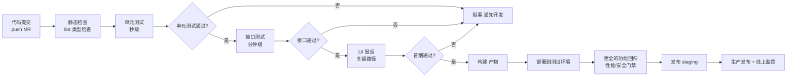
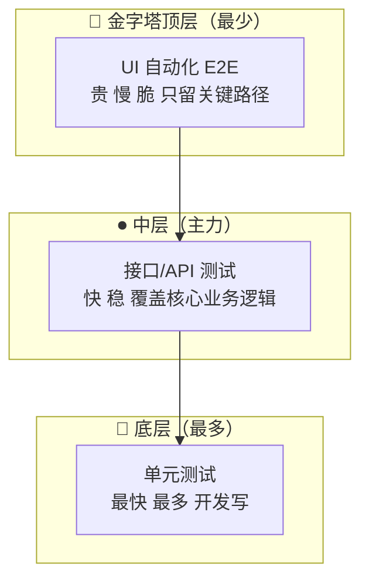
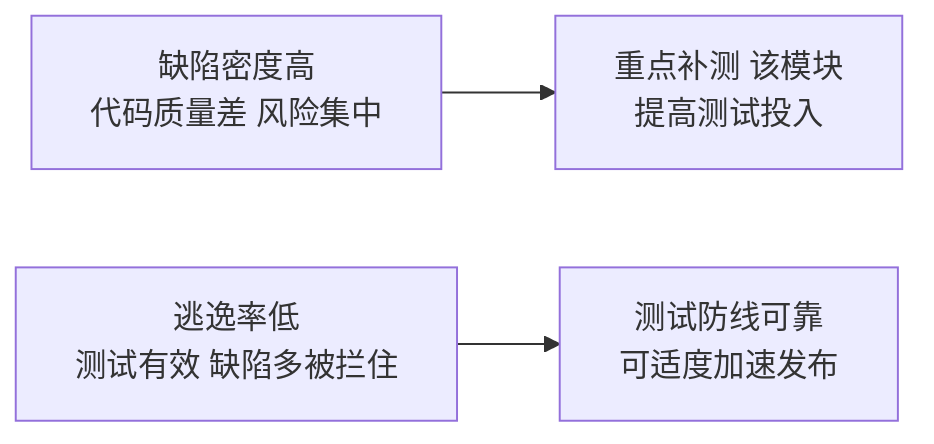

<DifficultyBadge level="advanced" />

# 测试策略与 CI/CD

## 一句话解释

测试策略回答"**在哪个层级、用什么方式、花多少成本去测**"，CI/CD 让测试**自动、快速、持续地跑在每个代码提交上**——二者的结合，是把质量从"发版前人工冲刺"变成"**开发过程内建的持续防线**"的核心工程能力，也是 QA 岗从"点工"走向"质量工程师"的分水岭。

## 核心流程：测试在 CI 流水线中的位置



## 深入理解

### 1. 测试金字塔：接口测试为主、UI 为辅（测试岗视角）

**经典金字塔**（从下到上，越往上越贵、越慢、越脆）：



| 层级 | 谁来写 | 速度 | 稳定性 | 覆盖重点 | 测试岗投入 |
|------|--------|------|--------|---------|-----------|
| 单元测试 | 开发 | 秒级 | 高 | 函数/模块逻辑 | 关注覆盖率与门槛 |
| **接口测试** | **QA 主力** | 分钟级 | 高 | 业务逻辑、参数校验、权限、异常分支 | **投入最多** |
| UI 自动化 | QA | 慢 | 低（flaky） | 关键端到端流程、冒烟 | 克制，只留核心 |

> **考点**：测试岗视角的金字塔和开发视角不同——**你的主战场是中间层（接口测试）**。原因：接口测试快、稳、能覆盖异常分支和权限逻辑，而且业务价值高；UI 自动化只是金字塔顶端"点上的点缀"，不应该堆数量。**"先保证接口层覆盖充分，再做少量 UI 冒烟"** 是最被认可的测试分层策略。

### 2. 测试左移与右移

**左移（Shift-Left）**：把测试活动提前到开发早期。

| 阶段 | 左移动作 |
|------|---------|
| 需求分析 | QA 参与评审，提前发现需求歧义、遗漏场景 |
| 设计评审 | 提前识别高风险点，设计测试策略 |
| 编码阶段 | 开发自测、代码评审、单测、契约测试 |
| 提交阶段 | CI 自动跑单测 + 接口测试，问题早暴露 |

**右移（Shift-Right）**：把质量验证延伸到生产环境。

| 阶段 | 右移动作 |
|------|---------|
| 灰度发布 | 小流量先上，监控错误率 |
| 线上监控 | 错误率、响应时间、日志、埋点 |
| 生产验证 | 上线后核心路径巡检（canary 冒烟） |
| 线上回归 | 用真实数据/流量持续验证 |

> **考点**：一句话总结——**左移让 bug 更早被发现（修复成本指数下降），右移让问题在线上更早暴露（比用户先发现）**。前端背景可以说：**"我平时最常做的事就是左移——自己写单测、做自测，理解这种'质量前置'的价值。"**

### 3. 测试环境管理：dev / test / staging / prod

| 环境 | 用途 | 数据 | 稳定性 | 谁能访问 |
|------|------|------|--------|---------|
| **dev**（开发） | 开发自测、联调 | 脏数据、随意造 | 不稳定 | 开发 |
| **test**（测试） | 功能测试、接口测试、UI 自动化 | 独立测试数据 | 较稳定 | QA 为主 |
| **staging**（预发布） | 预发布验证、回归、性能/安全测试 | 接近生产的造数 | 稳定 | QA + 产品验收 |
| **prod**（生产） | 线上用户 | 真实数据 | 最高 | 所有人 |

**环境管理核心原则：**

1. **环境隔离**：test 环境数据不能污染 staging，staging 要尽量模拟生产（版本、配置、数据量级）
2. **配置分离**：数据库、缓存、第三方回调地址按环境配置化，禁止硬编码
3. **环境可用性**：test/staging 被占用或挂掉会阻塞整个测试流程 → 需要环境自动化部署与"环境申请/释放"机制
4. **部署策略**：环境从代码构建自动部署，避免"本地能过、环境不能过"

> **考点**：面试常问"**测试环境怎么管理？**"——别只说"有四个环境"。加分回答：**环境配置化 + 自动化部署 + 数据隔离 + 环境就绪检查（health check）+ 环境占用/释放机制**。前端背景的加分点：你懂"前端构建产物 + 后端 API 版本"的配套部署，能发现"前端和后端版本不匹配导致测试环境不可用"这类问题。

### 4. 测试数据管理

测试数据是测试的"弹药"，管理不好会导致**用例偶发失败、结果不可信**。

| 挑战 | 表现 | 对策 |
|------|------|------|
| 数据耦合 | 用例依赖某条现存数据，被别人改了/删了 | **用例独立造数**：每个用例自带准备/清理（setup/teardown） |
| 数据共享冲突 | 并行执行互相污染 | 随机后缀、独立账号、按用户隔离 |
| 环境数据混乱 | test/staging 数据混在一起 | 环境隔离 + 定期重置 |
| 生产数据敏感 | 用生产数据测试有合规风险 | 脱敏、造数脚本 |

**测试数据四类来源：**

```text
1. 造数脚本：SQL / 接口脚本，批量生成（推荐，可控可重复）
2. API 直插：通过接口预置数据（比 UI 快得多）
3. 数据库备份恢复：还原到固定基线快照（回归场景）
4. Mock/桩：第三方系统用 fixture 替代（不可控依赖）
```

> **考点**：测试数据管理讲透一个点就够——**"用例要自带数据生命周期：测试开始前造数，测试结束后清理，独立于他人数据。"** 这是测试可靠性的地基。

### 5. CI 流水线中测试的编排

**分层流水线设计（按快慢分层，尽早失败）：**

| 阶段 | 内容 | 触发时机 | 失败处理 |
|------|------|---------|---------|
| 提交阶段 | lint、类型检查、单元测试 | 每次 push | 阻塞合并 |
| 集成阶段 | 接口测试、构建产物 | 每次 push / 合并前 | 阻塞合并 |
| 系统阶段 | UI 冒烟（关键路径）、回归 | 合并后 / 定时 | 阻塞发布 |
| 发布阶段 | 性能压测（大改时）、安全扫描 | 发布前 | 阻塞发布 |
| 线上阶段 | 灰度监控、线上巡检 | 发布后 | 告警回滚 |

**质量门禁（Quality Gate）**：每个阶段的通过/失败标准写进流水线，失败即阻断。典型门禁：

```text
- 单元测试覆盖率 ≥ 80%（新增代码差分覆盖）
- 接口测试全部通过，错误率 0
- UI 冒烟关键路径 100% 通过
- 性能：核心接口 Tp99 ≤ 800ms，TPS 达标
- 安全扫描无高危漏洞
```

> **考点**：面试问"**测试怎么融入 CI？**"的完整答案——**按"快慢分层"编排：秒级的单测在每次提交跑、分钟级的接口测试在合并前跑、慢的 UI 冒烟在合并后跑；每层设质量门禁，失败即阻断；发布前再做性能/安全大检查。核心思想是"尽早失败、快速反馈"。**

### 6. Jenkins / GitLab CI 基础

**Jenkins（老牌、通用、插件生态）：**

```groovy
// Jenkinsfile —— Pipeline as Code，声明式
pipeline {
    agent any
    stages {
        stage('Checkout') { steps { checkout scm } }
        stage('Unit Test') {
            steps { sh 'npm test' }
            post { success { junit 'reports/*.xml' } }   // 收集测试报告
        }
        stage('Interface Test') {
            steps { sh 'pytest tests/interface -m smoke' }
        }
        stage('UI Smoke') {
            steps { sh 'pytest tests/ui -m smoke' }
        }
        stage('Deploy to test') {
            steps { sh './deploy.sh test' }
        }
    }
}
```

**GitLab CI（声明式 YAML，托管在仓库里）：**

```yaml
# .gitlab-ci.yml —— 按 stage 分阶段，失败即中断后续
stages:
  - test
  - deploy

unit-test:
  stage: test
  image: node:20
  script:
    - npm ci
    - npm run test -- --coverage
  artifacts:                 # 测试报告作为产物保留
    paths:
      - reports/
    when: always

interface-test:
  stage: test
  image: python:3.12
  script:
    - pip install -r requirements.txt
    - pytest tests/interface -m smoke
  rules:
    - if: $CI_PIPELINE_SOURCE == "merge_request_event"   # 合并前跑

ui-smoke:
  stage: test
  image: mcr.microsoft.com/playwright:v1.40
  script:
    - npx playwright test --shard=$CI_NODE_INDEX/$CI_NODE_TOTAL   # 并行分片
  parallel: 4

deploy-test:
  stage: deploy
  script:
    - ./deploy.sh test
  only:
    - main
```

| 对比 | Jenkins | GitLab CI |
|------|---------|-----------|
| 配置方式 | Jenkinsfile（Groovy，服务端配置） | `.gitlab-ci.yml`（代码仓库内） |
| 部署形态 | 独立服务，自己搭 | GitLab 内置，SaaS 或自托管 |
| 插件 | 生态庞大 | 靠 GitLab 内置能力 + runner |
| 学习成本 | 较高 | 较低（YAML 直观） |

> **考点**：不要求背语法，但要**看懂流水线结构**：stage 阶段 → job 任务 → script 脚本 → artifacts 产物 → rules/only 触发条件。面试能说出"**提交触发单测 → 合并前跑接口测试 → 合并后跑 UI 冒烟 → 测试通过才部署到 test 环境**"的编排逻辑即可。

### 7. 测试报告与质量度量

| 度量指标 | 定义 | 意义 |
|---------|------|------|
| **通过率** | 通过用例 / 总用例 | 版本质量的直接信号 |
| **缺陷密度** | 缺陷数 / 代码行数（或千行） | 衡量代码质量，密度高 → 该模块风险高 |
| **逃逸率** | 线上发现的 bug / (线上+测试阶段发现的总 bug) | 衡量测试的有效性，越高说明测试越漏 |
| 测试覆盖率 | 被测试覆盖的代码/需求比例 | 衡量测试充分性（不是越高越好） |
| 缺陷修复率 | 已修复缺陷 / 发现缺陷 | 衡量修复效率与延期风险 |
| 需求覆盖率 | 被测试覆盖的需求数 / 总需求数 | 测试对需求的覆盖程度 |

**两个关键指标的关系：**



> **考点**：**缺陷密度衡量"代码坏不坏"，逃逸率衡量"测试有没有用"**。面试加分点：**"我会用逃逸率评估测试改进方向——逃逸率突然升高，说明最近的新增测试没覆盖到真实风险点，要回头查是需求遗漏还是用例设计问题，而不是只看通过率。"** 注意：**通过率 100% 不等于质量好**——如果用例设计覆盖不足，通过率高也只是"该测的没测"。

### 8. 敏捷测试：Scrum 中 QA 的角色

| 传统测试（瀑布） | 敏捷测试（Scrum） |
|----------------|------------------|
| 测试在开发完成后集中做 | 测试在**每个迭代内**持续做 |
| QA 只负责"找 bug" | QA 是**质量角色**：参与需求、设计测试策略、推动自动化 |
| 大版本一次性发布 | 持续集成、频繁交付 |
| 测试靠文档驱动 | 验收标准（Definition of Done）驱动 |

**Scrum 中 QA 的日常工作：**

1. **迭代规划**：参与需求评审，把需求拆成可测的验收标准（AC）
2. **迭代内测试**：边开发边测，写接口测试 + 自动化用例
3. **DoD（完成定义）**：每个 Story 的完成 = 功能实现 + 测试通过 + 文档更新
4. **缺陷管理**：跟踪缺陷、优先级评估、回归验证
5. **持续优化**：复盘迭代，改进用例设计、提升自动化覆盖率

> **考点**：敏捷测试的核心转变是——**QA 不再"最后验收"而是"全程参与质量建设"**。前端背景答这个题有天然素材：**你习惯小步交付、持续集成、代码评审、自测单测，这些正是敏捷质量文化的具体实践，你会比纯测试背景更快适应。**

## 面试问法

- 🔥 **测试金字塔是什么？测试岗怎么分配测试层级？**
  - 底层单测（开发写、数量最多）、中层接口测试（QA 主力）、顶层 UI 自动化（少量关键路径）
  - 测试岗主战场是接口测试：快、稳、覆盖异常分支；UI 自动化只挑核心冒烟

- 🔥 **什么是测试左移、右移？**
  - 左移：测试提前到需求/设计/编码阶段，bug 早发现早修复
  - 右移：测试延伸到生产环境（灰度、监控、线上巡检）
  - 核心：左移降修复成本，右移让问题比用户先暴露

- 🔥 **dev/test/staging/prod 环境怎么管理？**
  - 各自用途与数据隔离；配置分离、自动化部署、health check
  - 前端背景加分：关注前后端版本配套、环境部署一致性

- 🔥 **测试数据怎么管理？**
  - 用例自带数据生命周期（setup 造数 / teardown 清理）、独立账号随机后缀、环境数据隔离、造数脚本或 API 直插、外部依赖 mock

- 🔥 **CI 流水线里测试怎么编排？**
  - 按快慢分层：提交跑单测 → 合并前跑接口测试 → 合并后跑 UI 冒烟 → 发布前性能/安全
  - 质量门禁失败即阻断；尽早失败、快速反馈

- 🔥 **什么是缺陷密度和逃逸率？怎么用它们评估质量？**
  - 缺陷密度 = 缺陷数/千行，衡量代码质量；逃逸率 = 线上 bug/总 bug，衡量测试有效性
  - 逃逸率高 → 测试覆盖不到位，要改进用例设计而非只看通过率

- ⭐ **Jenkins 和 GitLab CI 的区别？**
  - Jenkins：独立服务、Groovy 配置、插件生态庞大；GitLab CI：仓库内 YAML、GitLab 内置、runner 执行
  - 现在主流趋势是"配置即代码"（Pipeline as Code），GitLab CI / GitHub Actions 更常见

- ⭐ **质量门禁怎么设？通过率 100% 就代表质量好吗？**
  - 门禁：覆盖率、接口通过率、冒烟通过率、性能 Tp99、安全扫描
  - 通过率高≠质量好：用例覆盖不足时，通过率高只是"该测的没测"

- ⭐ **敏捷测试中 QA 的角色和传统测试有什么不同？**
  - 从"最后验收找 bug"到"全程参与质量建设"：需求评审定 AC、迭代内持续测试、自动化、DoD、复盘
  - 前端背景：本就习惯小步交付/持续集成/自测，适应快

## 💡 AI 辅助学习

> 用这个 Prompt 练测试策略设计思维：
> "你是一名资深 QA 工程师。公司要上线一个电商中台系统，技术栈 Vue + Spring Boot + MySQL + Redis，每周一个小版本发布，团队用 GitLab CI。
> 请：1）画出测试金字塔并为每一层给出具体的测试方案（单测、接口、UI 冒烟各测什么、谁来写、数量比例）；
> 2）设计完整 CI 流水线（含阶段、触发时机、质量门禁、失败处理），给出 .gitlab-ci.yml 骨架；
> 3）设计测试环境与测试数据管理方案（四环境职责、造数与隔离策略）；
> 4）设计三个质量度量指标（缺陷密度、逃逸率、通过率）的统计口径与改进闭环。"
>
> 再给一个面试模拟 Prompt：
> "请扮演面试官，围绕'测试策略与 CI/CD'对我进行 5 轮面试追问，每轮先问我再给参考回答，重点考察：金字塔分层、左移右移、质量门禁、逃逸率分析、敏捷 QA 角色。"

## 关联知识

- [软件测试基础](./test-basics) — 测试理论与策略的基础
- [测试用例设计](./test-case-design) — 用例设计支撑分层测试
- [接口测试](./interface-testing) — 测试金字塔中层的核心实践
- [UI 自动化测试](./ui-automation) — UI 冒烟与金字塔顶层的落地
- [覆盖率与 TDD](./coverage-tdd) — 覆盖率指标与质量门禁
- [性能测试入门](./performance-testing) — 发布前的性能门禁
- [转岗测试面试专题](./test-interview) — 测试策略相关面试题
- [前端测试体系](/engineering/frontend-testing) — 开发视角的测试体系（对照阅读）
