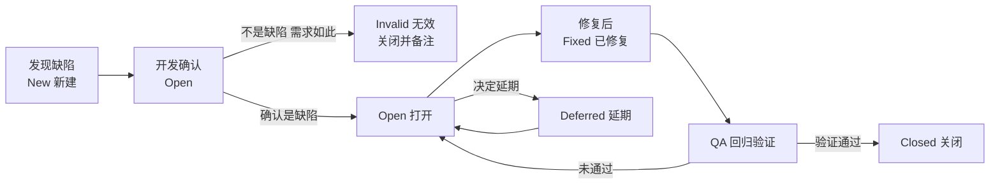

<DifficultyBadge level="intermediate" />

# 转岗测试面试专题

## 一句话解释

转岗 QA 面试和社招测试面试的差别在于——面试官真正想验证三件事：**你有没有测试思维**（用例设计、缺陷判断）、**你为什么转行**（动机是否可信）、**你转过来能带来什么**（差异化价值）。前端的底子让你的答案能"**比别人多一个维度**"，这篇就是帮你把这三个问题答到满分。

## 转岗定位：先把你的"一句话故事"想清楚

面试官问"为什么转测试"，其实是在问**"你的过去怎么支撑你的未来"**。前端转 QA 的黄金叙事：

> **"我在前端开发里最擅长的不是写功能，而是帮产品把质量兜住——自测、单测、排查线上 bug、写自动化用例。我发现真正让我有成就感的是'发现问题并提前拦住问题'，而不仅仅是'把功能写完'。转测试，是把我在前端积累的代码能力、浏览器原理、自动化经验，投入到'把质量问题前置、系统化兜住'这件事上。"**

三个叙事支点（面试时灵活组合）：

1. **前端背景 → 质量视角**：你天然懂"用户看到的界面背后发生了什么"，写用例时能想到 DOM、异步、兼容性、异常态
2. **代码能力 → 自动化优势**：你会写代码，UI 自动化（Playwright/Selenium）、接口测试、性能脚本对你没有学习门槛
3. **开发协作 → 沟通优势**：你懂开发的实现逻辑、估算、优先级，和开发沟通缺陷时"能说到点子上"，QA 和开发是同一个语言体系

> **注意**：不要说"我不想写业务代码了""前端太难了卷不动"这类**消极动机**。要讲**"我想往质量方向深耕，且前端能力是巨大加成"**的**主动选择**。

## 深入理解

### 1. 转行测试 15+ 常见面试题与参考回答

#### 🔥 高频题

**Q1：什么是软件测试？它的目的是什么？**

> 软件测试是在**规定的条件下**对软件进行操作，发现缺陷、验证软件是否满足需求的**活动过程**。目的不是"证明软件没 bug"，而是**尽早、尽可能多地发现缺陷**，评估软件质量，为发布决策提供依据。
>
> 补充要点：测试只能证明"有错"，不能证明"无错"；发现缺陷只是手段，最终目的是**提升质量、降低风险、控制成本**。

**Q2：你为什么从前端转测试？（转岗必问）**

> 用上文"一句话故事"回答，落到三个词：**动机**（享受发现和拦截问题）、**优势**（代码能力 + 浏览器原理 + 自动化）、**承诺**（想在质量方向长期深耕）。再加一个"我在前端已经做过测试相关的事"的具体例子（写过单测、排过线上 bug、搭过自动化脚本），证明不是一时兴起。

**Q3：软件测试的分类有哪些？**

> 按**是否关心内部结构**分：黑盒测试（只看输入输出，不看代码）、白盒测试（看代码逻辑，如单测、分支覆盖）、灰盒测试（介于两者，如接口测试、渗透测试）。
>
> 按**测试阶段**分：单元测试、集成测试、系统测试、验收测试。
>
> 按**测试类型**分：功能测试、性能测试、兼容性测试、安全测试、易用性测试、接口测试、回归测试、冒烟测试等。
>
> 补充：前端背景可自然带一句——"我在前端写过单测（白盒），也做接口联调和 E2E（黑盒），两种视角我都接触过。"

**Q4：一条测试用例包含哪些要素？**

> 核心八要素：**用例编号、所属模块、用例标题、前置条件、测试步骤、测试数据、预期结果、实际结果**。外加：优先级、用例类型、设计人、关联需求/缺陷。
>
> 一句话记忆：**给谁测、在什么条件下、怎么操作、期望得到什么**。

**Q5：软件测试的基本流程是什么？**

> 需求分析 → 测试计划 → 测试设计（用例）→ 测试执行 → 缺陷跟踪 → 测试报告 → 上线验证与回归。
>
> 强调：不是写用例才叫测试，**需求评审阶段就要参与**（发现需求歧义是最便宜的修复）；测试报告要给出"是否可发布"的结论。

**Q6：测试计划包含哪些内容？**

> 项目背景与目标、测试范围（测什么/不测什么）、测试策略（怎么测、用哪些方法）、测试环境与资源、测试进度安排、风险与应对、质量标准与退出准则、交付物清单。
>
> 一句话：**范围、方法、资源、时间、风险、标准**，六要素。

**Q7：Bug、Defect、Error、Fault、Failure 有什么区别？**

> - **Error**（错误）：人写代码时的错误，如少个分号、逻辑写错
> - **Defect/Fault**（缺陷）：由 Error 导致的代码中的潜在毛病（bug）
> - **Failure**（失效）：运行 defect 时才表现出的错误行为
> - **Bug** 和 **Defect** 日常混用，指同一个东西——**代码里的毛病**；Failure 是它"发作"出来的现象
>
> 一句话：**Error 造成 Defect，Defect 触发 Failure**。

**Q8：Bug 的生命周期是什么？发现 bug 后你怎么处理？**



> 补充处理流程（QA 视角）：**复现 → 记录（含环境/步骤/预期/实际/证据截图日志）→ 提缺陷 → 与开发确认 → 跟进修复 → 回归验证 → 关闭**。前端背景加分点：**你定位过线上 bug，能描述"前端复现 + 看 Network/Console + 判断前端还是后端问题"的排查路径**，这在提 bug 时特别有价值。

**Q9：缺陷的严重程度（Severity）和优先级（Priority）怎么区分？**

| 维度 | 严重程度 | 优先级 |
|------|---------|--------|
| 回答什么 | 缺陷**影响多大**（损坏程度） | **先修哪个**（时间紧迫性） |
| 高 | 系统崩溃、核心功能不可用、数据丢失 | 立即修复，阻塞发版 |
| 中 | 功能异常但可用、有绕行方案 | 本版本修复 |
| 低 | 界面不美观、文案错误 | 可延期 |
| 提法 | 高严重 + 低优先（如不常用的边缘场景崩溃） | 低严重 + 高优先（如影响运营数据的功能小问题） |

**Q10：怎么保证用例覆盖率？**

> 三层思路：**① 需求覆盖**——每条需求都能追溯到用例，用需求追踪矩阵（RTM）检查；**② 方法覆盖**——等价类、边界值、场景法、错误推测法组合使用，不遗漏边界和异常分支；**③ 风险覆盖**——按功能重要度和缺陷历史密度分配用例数量，高风险多测。
>
> 补充：覆盖率不是越高越好，**"该测的测到"比"堆数量"更重要**；结合自动化把高频回归用例沉淀下来，手工精力留给探索性测试。

#### ⭐ 中频题

**Q11：怎么测一个接口？**

> 分五步：**① 明确接口**（协议、方法、URL、请求/响应参数、鉴权）；**② 设计用例**——正常参数（含边界值）、异常参数（空、超长、类型错）、非法/越权 token、不存在资源、并发重复请求、大数据量；**③ 准备数据与环境**；**④ 执行断言**——状态码、响应体结构、业务结果落库、响应时间；**⑤ 异常场景**——超时、网络错误、依赖服务不可用。
>
> 工具：Postman / Apifox / Jmeter / Python requests。前端背景加分：**"我对 HTTP、请求头、JSON、鉴权（token/cookie）非常熟，写接口用例基本零门槛。"**

**Q12：什么是回归测试？什么时候做？**

> 修改了代码（修 bug、加功能、重构）之后，**验证原有功能没有被破坏**的测试。时机：每次代码变更后、发版前、上线后。策略：优先回归受影响模块 + 核心主流程（自动化回归池）。
>
> 一句话：**确认"改了一处，别的地方没坏"。**

**Q13：什么是等价类划分和边界值分析？**

> **等价类**：把输入划分成若干等价集合，每个集合取一个代表值测试即可（一个有效类 + 多个无效类）。**边界值**：bug 最容易出在边界附近，所以重点测边界值（如 1-100 的输入，测 0、1、99、100、101）。
>
> 两者结合是**黑盒用例设计的标配**：先划分等价类，再对每个类的边界做补充。

**Q14：什么是冒烟测试、什么是兼容性测试？**

> **冒烟测试**：对主流程的快速冒烟验证（登录、核心功能跑通），像"开机冒烟"一样先确认基本可用，通常自动化、速度快。**兼容性测试**：验证软件在不同环境的表现——浏览器/操作系统/分辨率/移动端，重点是"不同环境是否功能正常、显示正常"。
>
> 前端背景加分：**"兼容性测试我最有发言权——我懂浏览器差异、CSS 兼容、响应式、设备像素比，知道哪些点最容易出兼容问题。"**

**Q15：开发说"这个 bug 不用改，需求就是这样"，你怎么处理？**

> 不硬刚，四步：**① 确认需求来源**——翻需求文档/原型，需求真这么写吗？**② 判断是"实现偏差"还是"需求本身不合理"**——需求这么写但明显不合理（如必填项没有校验），要提出来；**③ 用证据说话**——给出用户视角的影响、竞品做法；**④ 升级决策**——与产品确认，若产品也确认"就这样"，则标记为"需求如此"关闭，但保留记录。
>
> 原则：**QA 的价值不是"所有问题都要改"，而是"让每个不改的决定都有依据"。**

**Q16：项目时间很紧，测试做不完怎么办？**

> 不能无条件压缩测试，要**基于风险做取舍**：① 先跑核心主流程（冒烟）+ 高风险模块；② 回归用自动化快速兜底；③ 与产品/开发对齐，明确哪些功能本次不测、风险谁承担；④ 留下"未测清单"并在报告里声明风险。**不承诺不存在的质量，但要给决策提供透明信息。**

**Q17：上线后发现线上 bug 怎么办？**

> 第一时间响应：**① 快速评估影响范围**（多少人受影响、是否核心功能）；**② 紧急预案**——能否快速回滚、是否有绕行方案；**③ 复现与定位**（前端背景可以帮忙判断是前端还是后端问题）；**④ 修复与发布**；**⑤ 复盘**——为什么逃逸到线上，补用例防止再犯。
>
> 加分点：**QA 的价值不止"上线前拦截"，还有"上线后快速定位 + 复盘防再犯"。**

### 2. 用例设计题：完整作答示范（面试必考）

用例设计题的通用框架——**面试官给一个功能，你按"五步法"回答，既不乱也不漏：**

```text
① 明确范围：被测对象是什么，主要功能点有哪些
② 划分场景：正常流程、异常流程、边界情况、权限/安全、性能/兼容（视功能而定）
③ 先覆盖正常主流程（Happy Path）
④ 再挖异常：空值、超长、非法格式、重复提交、网络异常、越权
⑤ 补充边界与业务规则：数值边界、状态流转、多端/多浏览器
```

**示范一：测试一个登录页**

> **范围**：用户名 + 密码 + 登录按钮 + 验证码（可选）+ 记住我 + 忘记密码链接。
>
> **正常场景：**
> 1. 正确的用户名 + 正确的密码 → 登录成功，跳转首页，显示用户信息
> 2. 勾选"记住我"登录 → 关闭浏览器重开，仍保持登录态（有效期验证）
> 3. 登录成功后的 Cookie/Token 正确写入（可联动接口验证）
>
> **异常场景：**
> 4. 正确的用户名 + 错误的密码 → 提示"用户名或密码错误"，不跳转
> 5. 错误的用户名 + 正确的密码 → 同样提示，**不区分"用户名不存在"**（防枚举，安全细节）
> 6. 用户名为空 / 密码为空 → 前端必填校验提示，禁止请求发出
> 7. 用户名或密码超长（如 500 字符）→ 输入框限制或后端校验，不崩溃
> 8. 用户名含特殊字符 / 注入语句（`' OR 1=1--`）→ 不能绕过校验（SQL 注入防护）
> 9. 密码错误超过 N 次 → 账号锁定 / 出现验证码（防暴力破解）
> 10. 验证码错误 / 过期 → 提示重新输入
>
> **其他：**
> 11. 多次快速点击登录 → 不能重复提交（防重复请求）
> 12. 网络断开时点击登录 → 友好报错，不白屏、不卡死
> 13. 不同浏览器（Chrome/Edge/Firefox/Safari）/ 移动端 → 登录功能与样式正常
> 14. 按 Enter 键能否触发登录、Tab 键焦点顺序是否合理（易用性）

> **回答心法**：登录页是最常考的一题，**关键是"异常和安全的细节"**——能说出"不区分用户名不存在""防重复提交""SQL 注入""防暴力破解"，就比背一堆等价类强得多。前端背景可以加一句："**这些场景我当开发时都踩过坑，所以记得很清楚。**"

**示范二：测试一个购物车**

> **范围**：加购、数量修改、删除、选中/全选、清空、结算跳转、价格与库存联动。
>
> **正常场景：**
> 1. 商品详情页点击"加入购物车" → 购物车出现该商品，数量、价格正确
> 2. 同一商品重复加购 → 数量累加，而不是出现两条记录
> 3. 修改数量（+/- 输入）→ 小计 = 单价 × 数量，总价实时更新
> 4. 删除单个商品 → 列表更新、总价扣除
> 5. 全选/取消全选/单选 → 已选数量与合计金额正确联动
> 6. 勾选商品点击结算 → 跳转确认订单页，只带已勾选商品
> 7. 未登录加购 → 提示登录，登录后购物车数据保留（合并）
>
> **异常与边界场景：**
> 8. 数量修改为 0 或负数 → 拦截，不允许（或提示删除）
> 9. 数量超过库存上限 → 提示"库存不足"，不能超卖
> 10. 数量输入极大值 / 非数字 → 输入校验，不出现 NaN 或崩溃
> 11. 商品已下架 / 库存变为 0 → 列表标记"失效商品"，结算时排除并提示
> 12. 清空购物车 → 二次确认，空车态展示友好提示
> 13. 并发修改同一商品数量 → 以最终提交为准，不出现金额错乱
> 14. 切换账号 → 购物车数据隔离，A 用户看不到 B 用户的商品
> 15. 结算时商品价格已变动（活动结束）→ 提示价格变更，需重新确认

> **回答心法**：购物车测的是**"状态和金额的联动"**——核心是"数量、价格、选中、库存"这四者的变化一致性，以及并发和切换账号这类业务规则。

**示范三：测试一个搜索框**

> **范围**：关键词输入、搜索触发、结果展示、筛选排序、空结果、历史记录。
>
> **正常场景：**
> 1. 输入商品名关键词 → 返回相关结果，标题高亮关键词
> 2. 模糊搜索（输入"机"）→ 返回包含"手机""耳机"等含该字的结果
> 3. 多关键词（空格分隔）→ 命中任一或全部关键词（按业务规则）
> 4. 英文/数字/大小写混输 → 不区分大小写返回正确结果
> 5. 点击搜索 / 按 Enter → 均能触发搜索，URL 带搜索参数可分享
> 6. 搜索后筛选（价格/分类/品牌）+ 排序 → 结果正确联动
>
> **异常与边界场景：**
> 7. 搜索词为空 → 拦截或提示"请输入关键词"，不请求
> 8. 超长搜索词（如 1000 字）→ 截断或正常处理，不报错
> 9. 特殊字符（`%` `&` `#` `'`）/ 注入语句 → 按普通文本处理，不执行脚本/不绕过（XSS/SQL 注入）
> 10. 搜索不存在的关键词 → 展示"没有找到相关结果"+ 推荐内容，友好兜底
> 11. 连续快速搜索不同词 → 以最后一次为准（防旧结果覆盖新结果）
> 12. 无网络 / 接口超时 → 错误提示 + 重试按钮，不白屏
> 13. 搜索历史记录：是否记录、清空历史、点击历史可再次搜索
> 14. 移动端输入法搜索键 / 键盘弹出遮挡 → 正常可用

> **回答心法**：搜索框的加分细节是**"空值、超长、特殊字符/XSS、防竞态（旧请求覆盖新结果）、空结果兜底"**——这几条能讲出来，用例设计能力就立住了。

**用例设计题的通用加分话术：**

- "我会先用**等价类 + 边界值**划分输入，再补**场景法和错误推测法**找漏网之鱼。"
- "用例要覆盖**正常、异常、边界、安全、兼容、性能**六个维度（按功能取舍）。"
- "每条用例都有**可复现的前置条件、明确的步骤和可断言的预期结果**。"

### 3. 前端转测试的差异化优势怎么讲

**面试官视角的疑虑**：你测试经验是零，凭什么信你？——所以回答要**把前端经验"翻译"成测试资产**：

| 前端资产 | 翻译成 QA 语言 | 面试怎么讲 |
|---------|---------------|-----------|
| 会写 JS/TS、懂 DOM | **自动化零门槛** | "UI 自动化的定位器、等待策略、断言对我来说没有学习成本，甚至能写得更稳" |
| 懂浏览器原理、异步、渲染 | **懂得 flaky 的根因** | "我知道元素为什么没渲染完、异步接口什么时候回来，能写出不 flaky 的自动化" |
| 做过接口联调、看 Network | **接口测试上手快** | "HTTP、JSON、鉴权、状态码我天天打交道，接口用例设计是我强项" |
| 排过线上 bug、定位问题 | **缺陷质量高** | "我提的 bug 会带完整的复现路径和证据，甚至能初步判断是前端还是后端问题" |
| 懂兼容性、响应式 | **兼容测试专家** | "浏览器差异、CSS 兼容、移动端适配我比普通 QA 更敏感" |
| 习惯 Code Review、自测 | **质量意识内建** | "我在开发时就有质量思维，会主动补单测、盯覆盖率、验收自己的改动" |

**"为什么转测试"的完整话术结构（30 秒版本）：**

> "我做前端两年多，最深的体会是：**质量和体验才是用户感知到的产品**。我一直在做自测、写单测、排线上 bug，慢慢发现自己最享受、最擅长的是'发现和拦住问题'。加上我代码能力强，自动化（UI/接口/性能）对我来说几乎零门槛，转 QA 不是'逃离前端'，而是**把我在前端积累的能力，投入到系统化保障质量这件事上**，并且前端转测试在沟通和自动化上有天然优势，这是我的主动选择。"

### 4. 简历怎么写测试相关项目（没有测试经验怎么包装）

**核心思路：不编造假经验，把"已有经历"用测试语言重新组织 + 用个人项目补足实战。**

**① 把前端开发经历"转述"成质量意识：**

```text
❌ 原写法：负责电商商城前端开发，使用 Vue + Element UI

✅ 测试视角写法：
电商商城前端开发（Vue + TypeScript）
- 负责登录、商品搜索、购物车、结算等核心模块前端实现，编写覆盖主要交互的
  单元测试与组件测试，保障核心流程回归质量
- 联调阶段主导接口自测，覆盖正常/异常/边界参数，拦截并跟进 10+ 个前后端联调缺陷
- 上线后配合排查线上问题，通过复现路径 + Network/Console 定位问题归属，
  推动修复并补充回归用例，线上逃逸率持续下降
```

**② 个人项目做自动化（补足"没有测试项目"的短板）：**

```text
个人项目：电商网站 UI 自动化测试框架（Playwright + Python）
- 基于 Page Object 模式搭建测试框架，封装登录页/商品页/购物车页页面对象
- 覆盖"登录→搜索→加购→结算"核心主流程，用例全自动等待、零 sleep，稳定运行
- 配置 CI（GitHub Actions）自动执行 + 失败保留 Trace，实现提交即回归
- 编写 30+ 条接口测试用例（Postman + Python requests），覆盖鉴权、参数异常、越权场景
```

**③ 简历必写的"测试关键词"（HR/系统筛选）：**

> 黑盒测试、用例设计（等价类/边界值）、缺陷管理、接口测试、UI 自动化、Playwright/Selenium、Postman、JMeter、CI/CD、回归测试、冒烟测试、测试金字塔、质量度量

**④ 没有真实测试岗位经验的应对话术（面试时主动说）：**

> "我很清楚我缺的是**真实项目的测试实战**，所以我自己搭了一套自动化测试框架练手（讲细节），并且我对测试流程、用例设计方法、缺陷管理做了系统学习。我的判断是：**代码能力和测试方法论我都具备，缺的只是上手机会，而这两个月我会用个人项目把动手能力补齐。**"

### 5. 面试反问环节（问到点子上，加分）

**该问的问题（体现专业度）：**

| 方向 | 示例问题 |
|------|---------|
| 团队测试体系 | "团队目前的自动化测试覆盖到什么程度？接口和 UI 层分别怎么组织？" |
| QA 工作方式 | "QA 在需求阶段就参与吗？用例评审是怎么做的？" |
| 工具链 | "团队主要用什么测试工具？有没有在推进 Playwright / CI 集成？" |
| 质量度量 | "团队怎么衡量测试效果？有在看逃逸率这类指标吗？" |
| 成长路径 | "QA 岗的成长路径是怎样的？有没有做性能/安全方向的机会？" |

**不该问 / 慎问的问题：**

- ❌ "测试岗是不是比开发轻松？"（暴露动机不纯）
- ❌ "转岗会不会降薪很多？"（第一轮别问薪资，谈薪环节再聊）
- ❌ "测完就没事了吧？"（暴露不理解测试责任）

## 面试问法

> 转岗测试面试的**问题清单**已在"深入理解"第 1 节给出完整参考回答，这里是考前 30 秒速记版：

- 🔥 **什么是软件测试？目的？** → 在规定条件下操作软件、发现缺陷；目的是尽早发现问题、评估质量、支撑发布决策；"测试只能证明有错，不能证明无错"
- 🔥 **为什么转测试？** → 主动选择：享受发现/拦截问题 + 前端代码能力是自动化优势 + 想在质量方向深耕；绝不讲"前端卷不动"
- 🔥 **测试用例有哪些要素？** → 编号、模块、标题、前置条件、步骤、数据、预期结果、实际结果
- 🔥 **软件测试流程？** → 需求分析 → 测试计划 → 用例设计 → 执行 → 缺陷跟踪 → 报告 → 上线回归
- 🔥 **测试计划包含什么？** → 范围、方法、资源、时间、风险、退出标准
- 🔥 **Bug 和 Defect 的区别？** → 日常混用；严格说 Error→Defect→Failure，Bug 即 Defect
- 🔥 **Bug 生命周期？** → New→Open→Fixed→(QA 回归)→Closed，含 Invalid/Deferred 分支
- 🔥 **严重程度 vs 优先级？** → 严重度=影响多大，优先级=先修哪个；可高严重+低优先、低严重+高优先
- 🔥 **测试一个登录页/购物车/搜索框？** → 用"五步法"：范围→场景→正常主流程→异常边界安全→兼容；完整示范见上文第 2 节
- 🔥 **怎么测一个接口？** → 明确接口→设计用例（正常/异常/越权/并发）→准备数据→执行断言→异常场景
- ⭐ **怎么保证覆盖率？** → 需求追踪矩阵 + 等价类/边界值/场景法 + 按风险分配；"该测的测到"比堆数量重要
- ⭐ **开发说"这是需求不是 bug"？** → 查需求来源→判断实现偏差还是需求不合理→用户视角证据→与产品确认，保留决策记录
- ⭐ **时间紧测试做不完？** → 基于风险取舍：先核心主流程+高风险，自动化兜底回归，声明"未测清单"与风险
- ⭐ **上线发现 bug？** → 评估影响→回滚/绕行→复现定位→修复发布→复盘补用例防逃逸
- ⭐ **前端转测试的差异化优势？** → 自动化零门槛 + 懂 flaky 根因 + 接口测试强 + bug 质量高 + 兼容性敏感（对照表见第 3 节）

## 💡 AI 辅助学习

> 用这个 Prompt 做转岗面试模拟：
> "你扮演一位资深测试团队负责人，面试一个前端转测试的候选人。请按以下顺序追问：
> 1）你为什么转测试？给出两种追问方式（温和追问、压力追问）；
> 2）请现场设计'测试一个登录页'的用例，并对我的回答逐条点评、指出漏掉的用例；
> 3）给我一个'前端转测试差异化优势'的完美回答模板；
> 4）模拟'开发说这不是 bug'、'测试做不完怎么办'两个场景的对抗式问答。
> 每轮先让我作答，再给参考回答。"
>
> 再给一个用例设计训练 Prompt：
> "给我 10 个常见的用例设计题（登录、购物车、搜索、下单、支付、上传文件、改密码、优惠券、注册、导出报表），每个题目给出完整的用例清单（正常/异常/边界/安全/兼容），作为我的背诵与练习素材。"

## 关联知识

- [软件测试基础](./test-basics) — 测试理论、方法分类的基础题
- [测试用例设计](./test-case-design) — 等价类/边界值/场景法精讲
- [缺陷管理](./defect-management) — Bug 生命周期、缺陷流程
- [接口测试](./interface-testing) — "怎么测一个接口"的完整实践
- [Python 自动化基础](./automation-basics) — 自动化脚本能力
- [UI 自动化测试](./ui-automation) — 简历里个人项目的主战场
- [性能测试入门](./performance-testing) — 性能测试面试题
- [测试策略与 CI/CD](./test-ci-strategy) — 测试金字塔、质量度量
- [简历撰写](/interview/resume-writing) — 简历包装方法论
- [面试心态与准备](/interview/interview-mindset) — 转岗面试的心态管理
