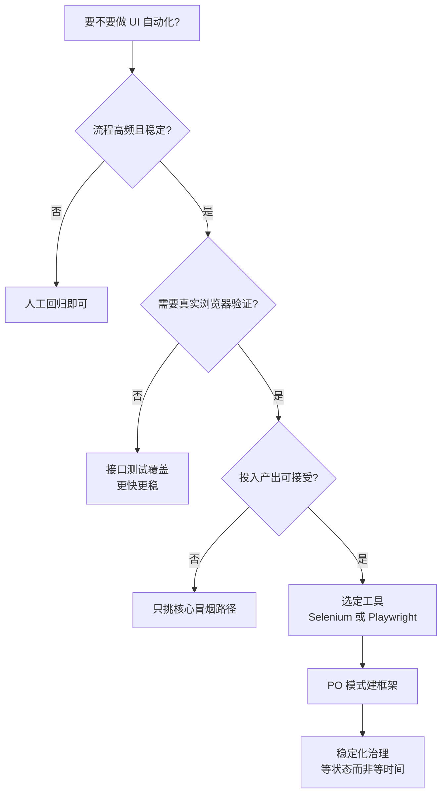

<DifficultyBadge level="advanced" />

# UI 自动化测试

## 一句话解释

UI 自动化测试用**脚本驱动真实浏览器**模拟用户操作（点击、输入、跳转），自动完成大量重复的界面回归验证——它回答的不是"函数对不对"，而是"**用户真实看到的界面流程能不能跑通**"。对前端背景转测试的你，**理解 DOM、异步渲染、事件机制**是定位器与稳定性问题的天然优势。

## 核心流程：UI 自动化的选型决策



## 深入理解

### 1. UI 自动化的适用场景与局限

**适合做 UI 自动化：**

| 场景 | 原因 |
|------|------|
| 核心功能回归 | 登录、下单、支付等每次发版都要跑，人工重复成本高 |
| 发布前冒烟测试 | 快速验证主链路没断 |
| 跨浏览器兼容 | 同一流程在不同浏览器/分辨率跑一遍 |
| 端到端用户流程 | 跨页面、跨模块的完整业务链路（接口测试覆盖不到） |
| 数据展示类校验 | 列表、图表、报表的正确性 |

**不适合 / 局限：**

| 局限 | 说明 |
|------|------|
| 慢 | 启动真实浏览器 + 渲染 + 操作，一条用例几秒到几十秒 |
| 脆弱（flaky） | 元素位置、样式、异步渲染一变就挂 |
| 维护成本高 | 选择器失效、页面重构导致大面积返工 |
| 只测 UI 层 | 无法定位底层逻辑 bug，覆盖不了异常分支 |
| 不测真实性能 | 自动化里的耗时 ≠ 真实用户性能 |
| 对变更敏感 | 前端技术栈重构（框架升级、组件库替换）会引发雪崩式失败 |

> **考点**：UI 自动化是**测试金字塔最顶端、最贵的一层**，只覆盖"高频 + 核心 + 跨系统"的关键路径。低层能覆盖的（单元、接口）不要往上堆——这是测试岗的基本判断力。

### 2. Selenium vs Playwright：为什么前端背景更推荐 Playwright

**全景对比：**

| 维度 | Selenium | Playwright |
|------|----------|-----------|
| 定位器 | 主打 XPath / CSS | `getByRole` / `getByLabel` 强定位器（语义化） |
| 等待机制 | 显式等待 `WebDriverWait`，要自己写 | **自动等待**：动作等"可见、稳定、可交互"，断言自动重试 |
| 调试能力 | 报错后靠日志猜 | **Trace 查看器**：步骤回放 + DOM 快照 + 网络请求 |
| 录制器 | 有限 | `codegen` 录制即生成用例 |
| 多引擎 | 理论支持 Chrome/Firefox/Safari/Edge | Chromium / Firefox / WebKit 三引擎 |
| 并行 | Selenium Grid（重，需自己搭） | 原生 worker 并行 + 分片 |
| 网络 mock | 难（需代理） | `page.route` 拦截请求，一行 mock 错误/慢网 |
| 移动端 | Appium 生态 | 侧重 Web，移动真机弱 |
| 语言 | Java/Python/JS/C#/Ruby | JS/TS/Python/Java/.NET |
| 架构 | WebDriver 协议（HTTP 序列化命令） | CDP（DevTools 协议）直接驱动 |
| 安装 | 手动管理 driver 版本 | `npx playwright install` 一条命令 |

**前端背景选 Playwright 的三个理由：**

1. **强定位器 = Testing Library 哲学**：`getByRole('textbox', { name: '用户名' })` 按"角色 + 可访问名"找元素，和你写前端时"语义化 HTML + aria-label"的思维完全一致，比 XPath 抗结构变化。
2. **自动等待消灭时序竞态**：前端最懂"接口还没回来、DOM 还没渲染完"的痛。Playwright 动作自动等"可见、稳定、可交互"，不用写 `sleep`。
3. **Trace 调试**：失败后回放每一步 DOM 快照 + 网络请求，前端的 DevTools 直觉直接迁移过来。

> **考点**：Selenium 仍是存量市场的"标准答案"（尤其 Java 团队），但**新项目 2026 年几乎默认 Playwright**。回答选型时别说"Playwright 最好"，要说"**存量看团队技术栈，增量选 Playwright，理由是可访问性定位器 + 自动等待 + Trace + 并行成本**"。

### 3. 元素定位八法（WebDriver 视角）

| 方法 | Selenium 写法 | 优先级 | 说明 |
|------|--------------|--------|------|
| **id** | `By.ID, "username"` | ① | 唯一、最快，页面 id 一般唯一 |
| **name** | `By.NAME, "username"` | ② | 表单元素常用 |
| **class** | `By.CLASS_NAME, "input-text"` | ④ | 一个 class 可能命中多个元素 |
| **tag** | `By.TAG_NAME, "input"` | ⑥ | 太宽泛，几乎不用 |
| **link text** | `By.LINK_TEXT, "点击注册"` | ⑤ | 精确匹配 `<a>` 的完整文本 |
| **partial link text** | `By.PARTIAL_LINK_TEXT, "注册"` | ⑦ | 匹配链接文本的一部分 |
| **CSS 选择器** | `By.CSS_SELECTOR, "#login input[type='password']"` | ③ | 灵活、快，能表达层级关系 |
| **XPath** | `By.XPATH, "//input[@id='username']"` | ⑧ | 最强但也最慢、最脆弱，滥用是 flaky 源头 |

```python
from selenium.webdriver.common.by import By

# 八法逐一示例（找同一个"用户名输入框"）
By.ID,              "username"                        # 1. id
By.NAME,            "username"                        # 2. name
By.CLASS_NAME,      "el-input__inner"                 # 3. class
By.TAG_NAME,        "input"                           # 4. tag
By.LINK_TEXT,       "登录"                            # 5. link text
By.PARTIAL_LINK_TEXT,"登"                             # 6. partial link text
By.CSS_SELECTOR,    "#login-form input[name='username']"  # 7. css selector
By.XPATH,           "//form[@id='login-form']//input[1]"   # 8. xpath
```

**定位优先级建议：** `id` → `name` → `CSS 选择器` → `class` → `link text` → `partial link text` → `tag` → `XPath`。

> **考点**：为什么 XPath 放最后？三个原因：**①慢**（走 DOM 树遍历）；**②脆**（`//input[1]` 依赖结构顺序，多一个元素就挂）；**③难读**。前端背景可以补充：**前端重构最常动的就是 DOM 结构和 class 名**，所以 `id` / `name` / 语义化属性最抗重构。

### 4. 等待策略：隐式 / 显式 / 强制

UI 自动化的最大敌人是**竞态**——元素还没渲染好就去点。三种等待：

```python
# 1. 强制等待（不推荐）——固定睡 3 秒，慢且脆弱
time.sleep(3)

# 2. 隐式等待——设置一次，全局生效；每次 find_element 轮询最多等 N 秒
driver.implicitly_wait(10)

# 3. 显式等待（推荐）——针对某个条件轮询，条件满足立刻返回
from selenium.webdriver.support.ui import WebDriverWait
from selenium.webdriver.support import expected_conditions as EC

WebDriverWait(driver, 10).until(
    EC.presence_of_element_located((By.ID, "username"))
)
WebDriverWait(driver, 10).until(
    EC.element_to_be_clickable((By.ID, "login-btn"))
)
```

| 等待方式 | 作用范围 | 优点 | 缺点 |
|---------|---------|------|------|
| 强制 `sleep` | 全局固定时长 | 简单 | 慢、环境一变就挂/浪费时间，**禁止用于正式用例** |
| 隐式 `implicitly_wait` | 所有 `find_element` | 一次配置 | 只等"元素在 DOM"，不等"可点击/可见/异步渲染完" |
| 显式 `WebDriverWait` | 指定条件 | 精准、快、可靠 | 每条关键操作都要写（PO 里封装） |

> **考点**：三种等待区别是面试必考。**Playwright 的 auto-waiting 本质是把"显式等待"内建到每个动作里**——`click()` 自动等到"可见 + 稳定 + 可接收事件"。所以 Playwright 里你几乎不用写等待，这是它把 E2E 从"脆弱"变成"可靠"的核心。记住一句话：**等状态，不要等时间。**

### 5. Page Object 模式（PO）：页面类封装 + 测试分离

**PO 模式把页面封装成一个类**：类的属性 = 元素定位器，类的方法 = 用户操作与断言。测试代码只调用这些方法，完全不接触选择器。

```python
# page_objects/login_page.py —— 页面类：集中管理定位器与操作
from playwright.sync_api import Page

class LoginPage:
    def __init__(self, page: Page):
        self.page = page
        # 定位器集中在类属性里，页面变了只改这里
        self.username = page.get_by_label("用户名")
        self.password = page.get_by_label("密码")
        self.login_btn = page.get_by_role("button", name="登录")
        self.error_msg = page.locator(".login-error")

    def open(self):
        self.page.goto("https://demo.example.com/login")

    def login(self, username: str, password: str):
        self.username.fill(username)
        self.password.fill(password)
        self.login_btn.click()

    def login_should_fail(self, expect_text: str):
        self.error_msg.wait_for()
        assert expect_text in self.error_msg.inner_text()
```

```python
# test_login.py —— 测试类：只描述"做什么"，不关心"怎么定位"
from page_objects.login_page import LoginPage

def test_login_success(page):
    login_page = LoginPage(page)
    login_page.open()
    login_page.login("qa_user", "qa_pass_123")
    # 断言登录成功：URL 跳转 + 欢迎语可见
    page.wait_for_url("**/home")
    expect(page.get_by_text("欢迎回来")).to_be_visible()

def test_login_wrong_password(page):
    login_page = LoginPage(page)
    login_page.open()
    login_page.login("qa_user", "wrong")
    login_page.login_should_fail("用户名或密码错误")
```

**PO 模式的三个收益：**

1. **复用**：一个登录页面被 100 条用例用，选择器只维护一处
2. **可读**：测试代码读起来像测试用例文档，非测试人员也看得懂
3. **抗变更**：前端改了 class 名，只改 Page 类，测试用例一行不动

> **考点**：PO 的核心是**"变化隔离"**——把"页面变化"（选择器）和"业务意图"（测试步骤）分离。面试时再补一句：**PO 还可以再抽象一层 Page Element / 组件对象**（如公共的弹窗、分页器），进一步减少重复。

### 6. 完整示例：登录 → 搜索 → 断言（Playwright + Python）

```python
from playwright.sync_api import Page, expect

def test_login_search_flow(page: Page):
    # ---- 1. 打开登录页 ----
    page.goto("https://demo.example.com/login")

    # ---- 2. 登录（get_by_label 语义化定位 + 自动等待） ----
    page.get_by_label("用户名").fill("qa_user")
    page.get_by_label("密码").fill("qa_pass_123")
    page.get_by_role("button", name="登录").click()

    # ---- 3. 断言登录成功：等 URL 跳转（状态，而非时间） ----
    page.wait_for_url("**/home")
    expect(page.get_by_role("heading", name="欢迎回来")).to_be_visible()

    # ---- 4. 搜索商品 ----
    search_box = page.get_by_placeholder("搜索商品 / 品牌")
    search_box.fill("无线耳机")
    search_box.press("Enter")

    # ---- 5. 断言搜索结果 ----
    # 等搜索结果容器出现，再断言第一条结果可见
    expect(page.locator(".search-result").first).to_be_visible()
    expect(page.get_by_text("无线耳机 Pro")).to_be_visible()

    # ---- 6. 失败留证：失败自动保留 trace / 截图（配置里开启） ----
    page.screenshot(path="evidence/login_search_flow.png")
```

**示例包含的稳定化要点：**

- 全部用**语义化定位器**（`get_by_label` / `get_by_role` / `get_by_placeholder`），不写 XPath
- 全程**零 `sleep`**，全部等状态（URL 跳转、元素可见）
- 断言对齐**用户可见结果**（"欢迎回来"文案），而不是"请求发出"
- 失败路径留截图/trace 作为证据

### 7. UI 自动化的维护成本与稳定化技巧

**成本为什么高（认清现实）：**

| 成本项 | 来源 |
|--------|------|
| 脚本编写 | 每条用例几十行，产出慢 |
| 环境维护 | 浏览器版本、driver、测试数据、测试账号 |
| 选择器失效 | 前端改 DOM / class 名 / 组件库升级 |
| flaky 排查 | 竞态、异步、动画、第三方服务抖动 |
| 误报负担 | 红测多了团队会"习惯性忽略"，防线失效 |

**稳定化技巧清单：**

1. **定位器语义化**：`getByRole` / `getByLabel` 优先，前端重构最不容易破坏；必要时与开发约定 `data-testid`
2. **PO 模式收敛选择器**：变化只影响 Page 类
3. **等状态而非等时间**：禁止 `sleep`，等元素可见 / URL 变化 / 网络响应
4. **测试数据隔离**：每个用例独立账号 / 独立数据，随机后缀，不共享数据库记录
5. **拦截外部依赖**：`page.route` mock 第三方接口、验证码，只测自己可控范围
6. **独立运行互不污染**：并行 worker 之间不能共享登录态 / localStorage
7. **失败留证**：trace + 截图自动上传 artifact，方便定位
8. **重试兜底但必根治**：CI 配 `retries: 2` 兜偶发抖动，但 flaky 率超阈值（如 1%）必须停工治理
9. **克制视觉回归**：只对核心页做截图比对，配容差，防基线漂移
10. **按层分配**：能下沉到接口测试的用例不要用 UI 自动化（更快更稳更省）

```python
# playwright 稳定化配置示例（config 里的关键项）
# from playwright.sync_api import sync_playwright
# 建议：CI 下 retries=2，失败保留 trace=on-first-retry，并行 workers=8
```

> **考点**：面试官最想听到的稳定化答案，不是"我加了重试"，而是——**"数据可控 + 等待状态化 + 环境隔离，重试只兜概率，不治根因；并且我会监控 flaky 率，红了就修，不让红灯被习惯性无视。"** 这直接对应测试工程化的成熟度。

## 面试问法

- 🔥 **Selenium 和 Playwright 的区别？你为什么（作为前端转测试）选 Playwright？**
  - Selenium 是 WebDriver 协议，XPath/CSS 定位，要手写显式等待，Grid 并行重；Playwright 用 CDP 直驱，强定位器 + 自动等待 + Trace + 原生并行分片
  - 前端背景选 Playwright：getByRole 定位 = Testing Library 语义化哲学；自动等待解决我熟悉的"异步渲染时序"问题；Trace 像 DevTools 一样回放
  - 补充：存量 Java 团队还是 Selenium 生态，选型看团队技术栈，新项目默认 Playwright

- 🔥 **UI 自动化适合哪些场景？有哪些局限？**
  - 适合：核心功能回归、发布前冒烟、跨浏览器、端到端用户流程
  - 局限：慢、脆弱 flaky、维护成本高、只测 UI 层、对前端重构敏感
  - 判断：低层能覆盖的（单测/接口）不要往上堆，UI 自动化只留关键路径

- 🔥 **元素定位八法有哪些？优先级怎么排？为什么 XPath 放最后？**
  - id / name / class / tag / link text / partial link text / CSS 选择器 / XPath
  - 优先级：id → name → CSS → class → link text → partial link text → tag → XPath
  - XPath 最后：慢（DOM 遍历）、脆（依赖结构顺序）、难读，前端重构最易破坏

- 🔥 **隐式等待、显式等待、强制等待的区别？**
  - 强制 sleep：固定时长，慢且脆弱，禁用
  - 隐式：全局作用于 find_element，只等元素存在，不等可交互/异步渲染
  - 显式：按条件轮询，精准可靠，推荐
  - 核心原则：**等状态而非等时间**；Playwright 自动等待 = 内建的显式等待

- 🔥 **Page Object 模式是什么？解决了什么问题？**
  - 页面封装成类：属性 = 定位器，方法 = 操作与断言；测试只调用方法
  - 收益：复用、可读、抗变更——选择器变化只改 Page 类
  - 核心思想：把"页面变化"与"业务意图"分离

- 🔥 **UI 自动化为什么容易 flaky？怎么稳定？**
  - 根因：时序竞态、异步渲染、数据不稳定、外部服务、并行污染、环境差异
  - 治理：等状态而非时间、fixture 拦截、测试数据隔离、语义化定位器、独立运行、容器化渲染、失败留 trace、flaky 率监控

- ⭐ **元素定位不到/超时了，你怎么排查？**
  - 先看 trace / 截图，确认页面状态（报错？没渲染？被弹窗遮挡？）
  - 检查定位器是否过时（id/class 是否改动），换语义化定位器
  - 检查是否 iframe（要先切换 `frame_locator`）、是否 shadow DOM
  - 检查等待条件：元素在 DOM ≠ 可见 ≠ 可交互

- ⭐ **怎么处理验证码、iframe、文件上传这类难搞的元素？**
  - 验证码：测试环境关闭 / 万能验证码 / 图片识别 / 接口 mock
  - iframe：先定位 iframe 再进内部（Playwright `frame_locator`）
  - 文件上传：`set_input_files` 直接指定本地文件，绕过系统弹窗

- ⭐ **什么时候不该做 UI 自动化？**
  - 一次性的验证、冒烟都不需要（纯 UI 展示无逻辑）、UI 频繁改动的早期阶段
  - 接口能覆盖的异常分支、性能问题（UI 自动化测不出真实性能）

## 💡 AI 辅助学习

> 用这个 Prompt 练 UI 自动化设计思维：
> "你是一名资深 QA。我要为电商网站（登录、搜索、加购、结算、支付、订单列表）搭建 UI 自动化框架。
> 请：1）用决策标准说明哪些流程必须做 UI 自动化、哪些交给接口测试，各给出理由；
> 2）为'登录→搜索→加购→结算'写一个 Page Object 模式的 Playwright Python 框架（LoginPage、SearchPage、CartPage、CheckoutPage 四个类 + 完整测试用例，含断言）；
> 3）列出该框架最容易 flaky 的 5 个点，逐个给出稳定化手段；
> 4）说明如何用 codegen 录制快速生成初版脚本、再如何重构为 PO 模式。"
>
> 再给一个定位器对比 Prompt：
> "请给我 20 组示例：同一元素分别用 getByRole / getByLabel / getByText / getByTestId 定位，并对比哪种最抗前端重构、为什么。"

## 关联知识

- [软件测试基础](./test-basics) — UI 自动化在测试体系中的定位
- [测试用例设计](./test-case-design) — 用例设计思维如何应用到 UI 自动化
- [Python 自动化基础](./automation-basics) — Python 语法与自动化脚本基础
- [E2E 与 Playwright 精讲](./e2e-playwright) — Playwright 定位器、page.route、Trace、分片的进阶内容
- [接口测试](./interface-testing) — 接口测试优先于 UI 自动化的分层原则
- [性能测试入门](./performance-testing) — UI 自动化与性能测试的区别
- [测试策略与 CI/CD](./test-ci-strategy) — UI 自动化在 CI 流水线中的位置与质量门禁
